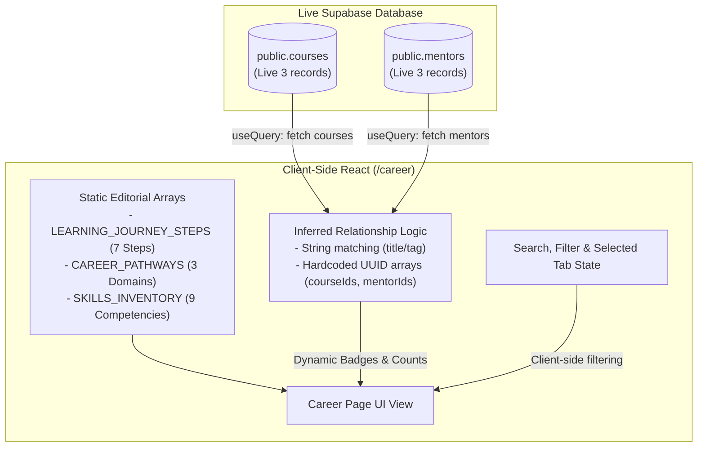
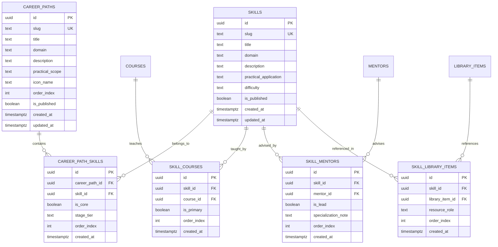
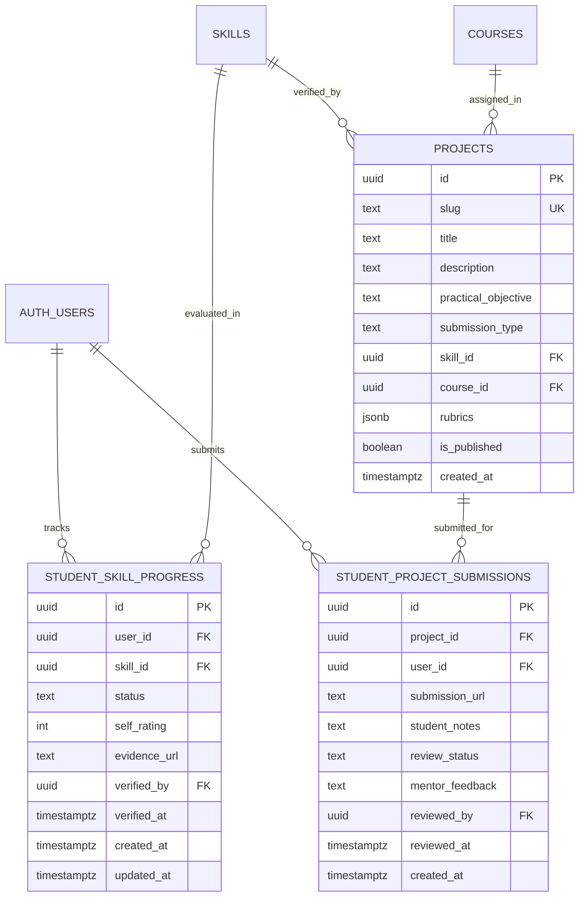
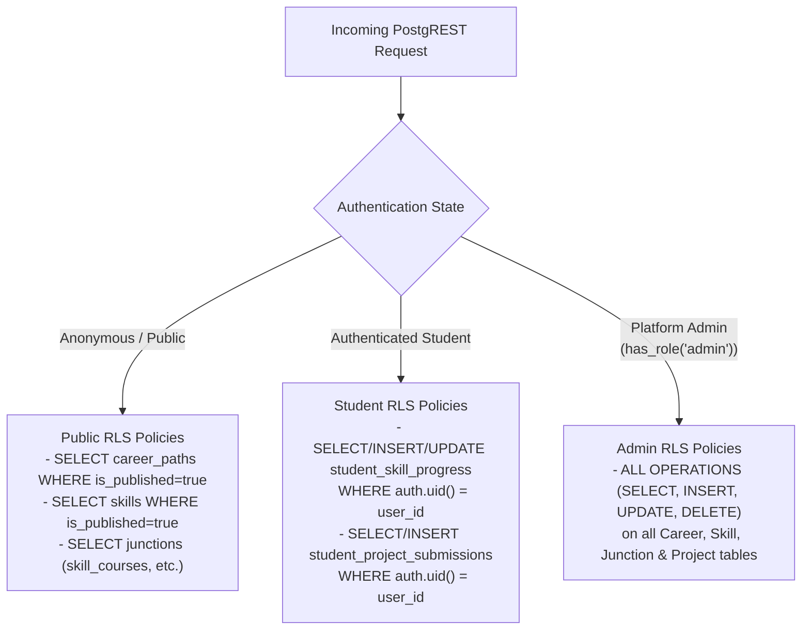

# IndustryMentor — Phase 6: Career & Skill System
## Backend Architecture Audit & Production Schema Design Document

**Document Version:** 1.0.0  
**Status:** ARCHITECTURE & SPECIFICATION ONLY (NO LIVE SQL EXECUTED)  
**Target Platform:** IndustryMentor (https://industrymentor.net/)  
**Database Engine:** PostgreSQL 15+ (Supabase) with Row Level Security (RLS)  
**Author:** Senior Product Architect, Database Architect & Supabase Security Engineer  
**Date:** September 2026  

---

## 1. Executive Summary

IndustryMentor bridges theoretical academia and real-world manufacturing operations in the Ready-Made Garments (RMG), Industrial Engineering, Merchandising, Quality Assurance, and Factory Compliance sectors.

In **Phase 6 Prompt 1**, a professional, responsive Career Pathway & Skill Discovery layer was successfully designed and deployed at `/career` and linked from the global navigation and homepage. This frontend layer currently presents three truthful industrial pathways, nine operational competencies, and a 7-step pedagogical journey grounded in the live platform's actual courses, instructors, and technical library materials.

In **Phase 6 Prompt 2**, we conduct a comprehensive backend architecture audit. Currently, career pathways, skills, and their inter-entity mappings are defined as TypeScript structures within the client application. While this provided immediate discovery value without schema disruption, it cannot support user skill tracking, dynamic admin authoring, applied project submissions, or personalized career recommendations.

This document defines the **production-ready relational data model, junction architectures, Row Level Security (RLS) policies, administrative CMS specifications, and deterministic seed migration strategy** required to transition the Career & Skill System to a first-class dynamic platform without modifying existing payment, enrollment, or course logic.

> [!IMPORTANT]
> **Strict Safety Constraint Observed:** In accordance with the project directives, **NO SQL HAS BEEN EXECUTED**, **NO DATABASE MIGRATION HAS BEEN APPLIED**, **NO PRODUCTION CODE DEPLOYED**, and **NO GIT PUSH PERFORMED** during this phase. All findings and proposed schemas are purely architectural and validated against live PostgREST read endpoints.

---

## 2. Current Database Reality

A read-only audit of the live PostgREST database schema was conducted. The audit verified the existence, constraints, foreign keys, and records of active platform tables, and confirmed the absolute absence of any career/skill-related tables.

### 2.1 Confirmed Existing Tables & Live Records

| Table Name | Primary Key | Key Foreign Keys / Attributes | Verified Live Records |
|---|---|---|---|
| `courses` | `id (uuid)` | `slug`, `title`, `price`, `is_published`, `category`, `level` | **3 Published Courses** |
| `course_modules` | `id (uuid)` | `course_id -> courses.id (ON DELETE CASCADE)` | Verified modules for all 3 courses |
| `mentors` | `id (uuid)` | `name`, `role`, `company`, `tags (text[])`, `is_active` | **3 Verified Active Mentors** |
| `library_items` | `id (uuid)` | `title`, `category`, `sub_category`, `file_url`, `is_published` | **3 Published Industrial Handbooks** |
| `profiles` | `id (uuid)` | `id -> auth.users.id (ON DELETE CASCADE)` | User profiles with roles and avatars |
| `messages` | `id (uuid)` | `mentor_id -> mentors.id (NULLABLE)`, `type`, `status` | General inquiries & Mentorship bookings |
| `purchases` | `id (uuid)` | `user_id -> auth.users.id`, `course_id -> courses.id` | Hardened manual verification workflow |
| `certificates` | `id (uuid)` | `user_id -> auth.users.id`, `course_id -> courses.id` | Authenticated completion credentials |
| `course_enrollments`| `id (uuid)` | `user_id -> auth.users.id`, `course_id -> courses.id` | Student learning state tracking |
| `user_roles` | `id (uuid)` | `user_id -> auth.users.id`, `role (app_role)` | Granular role-based security (`admin`, `student`)|
| `finance_categories`| `id (uuid)` | Internal accounting taxonomy | Active platform accounting |
| `finance_transactions`| `id (uuid)`| `category_id -> finance_categories.id` | Verified platform ledger |
| `site_settings` | `id (uuid)` | Key-value application configuration | Active configuration |

### 2.2 Verified Live Entity UUIDs (Baseline for Seed Strategy)

The architecture and future seed migrations are strictly grounded in these authentic records:

1. **Live Published Courses:**
   - `e373dcce-54fb-4a55-8070-54543691fedb`: *Garments Merchandising-from-order-to-shipment-excellence* (Instructor: M A QAIYUM TALUKDER)
   - `6c926dde-3139-475b-88b1-4bed05f69dda`: *Certified Elite-Performing Executive* (Instructor: Engr. Mehedi Hasan)
   - `4cde3695-c539-465e-830b-48eed5e46a36`: *Industrial Garment Quality Certification Course* (Instructor: Mrs Meng)

2. **Live Verified Mentors:**
   - `f10828d2-3877-4c2f-a94b-130f39a75df1`: *M A QAIYUM TALUKDER* (CEO & Founder; Tags: `AI Specialist`, `LSSBB`)
   - `a09cabea-b9e2-4b19-8f33-3fe793f20cf8`: *Engr. Mehedi Hasan* (COO; Tags: `EXCEL`, `3D DRAWING`, `CONSULTANT`)
   - `9e5c8522-0e03-46e9-8056-96b5358b40f9`: *Mrs Meng* (Quality Specialist; Tags: `Garments Quality Specialist`)

3. **Live Verified Industrial Library Resources:**
   - `713a6bd9-0ded-45d4-ad32-2734b7af6f78`: *"Lean six sigma"* (Category: `Garments`, Sub-Category: `Industrial Engineering`)
   - `96cdaeb7-e268-41fb-aa03-9eb7bb834eee`: *"KAIZEN METHODS"* (Category: `Garments`, Sub-Category: `IE`)
   - `f3696cd3-14b8-45db-a556-32332359e99e`: *"The Essentials of Supply Chain Management"* (Category: `Garments`, Sub-Category: `SCM`)

### 2.3 Confirmed Absent Tables (`PGRST205` / HTTP 404)

The database schema inspection confirmed that the following tables **DO NOT EXIST** in the live database:
- `career_paths`
- `skills`
- `career_path_skills`
- `careers`
- `categories` / `course_categories` / `course_tags`
- `skill_courses` / `skill_mentors` / `skill_library_items`
- `student_skill_progress`
- `projects` / `student_project_submissions`
- `mentor_availability` / `mentorship_sessions`

---

## 3. Current Frontend Data Flow

The `/career` route (`src/pages/Career.tsx`) functions as a hybrid static-dynamic discovery interface:



### 3.1 What Data is Static vs Dynamic?
- **Static:**
  - The 7-step pedagogical roadmap (`Discover` -> `Identify` -> `Learn` -> `Practice` -> `Mentor` -> `Portfolio` -> `Advance`).
  - Career pathway titles, domain categorizations, descriptions, practical scopes, and Lucide icon associations.
  - Skill inventory names, difficulty levels (`Foundational`, `Intermediate`, `Advanced`), and operational definitions.
- **Dynamic:**
  - Live courses fetched from `public.courses` (`useCourses` hook).
  - Live mentors fetched from `public.mentors` (`useMentors` hook).
  - Badges displaying real course counts and mentor counts.
  - Navigation handlers deep-linking to live course (`/courses/:courseId`) and mentor (`/mentors/:mentorId`) routes.

### 3.2 Inferred Relationships
Currently, `/career` calculates relevant courses and mentors dynamically using:
1. Direct array matching on hardcoded UUIDs: `item.courseIds?.includes(c.id)`.
2. Fallback text normalization: `c.title.toLowerCase().includes(domain.toLowerCase())` or `m.tags?.some(...)`.

---

## 4. Problems with Current Hardcoded Career Data

While the client-side approach ensured zero downtime and zero database mutations during the initial UI rollout, it introduces significant long-term structural limitations:

1. **Risk of Silent Orphaned References & Data Drift:**
   - If an administrator updates a course title, replaces a course, or archives a mentor in Supabase, the hardcoded IDs in the TypeScript code will silently orphan, leading to zero course/mentor badge counts.
2. **Administrative Lockout:**
   - Non-technical administrators and course managers cannot add a new career pathway (e.g., *Woven Garments Production Management* or *Garment Washing & Dyeing Operations*) or introduce new skills without filing an engineering ticket, editing React code, and deploying to Cloudflare Pages.
3. **No Student Competency Tracking:**
   - Because skills do not exist as entities in PostgreSQL with unique primary keys, there is no foreign key target for tracking student progress. The platform cannot record that a student has mastered *Standard Minute Value (SMV)* calculations or *AQL 2.5 Sampling Inspection*.
4. **Lack of Practical Project Association:**
   - Students cannot be assigned concrete industrial assignments (e.g., submitting an Excel Line Balancing Sheet or an Order TNA Calendar) tied to specific skills.
5. **SEO & Deep-Linking Deficit:**
   - Search engines cannot index dedicated landing pages for individual career tracks (e.g., `/career/garment-merchandising`) or high-intent skill search terms (e.g., `/skills/smv-time-study-line-balancing`).

---

## 5. Recommended P0 Schema (The Core Relational Foundation)

The P0 schema represents the minimal, robust, production-grade schema required to transition career pathways, skills, and entity relationships into PostgreSQL. It strictly adheres to 3NF, uses UUID primary keys, enforces referential integrity, and integrates with Supabase RLS.



### 5.1 SQL DDL Specifications (P0)

```sql
-- ============================================================================
-- P0 SCHEMA SPECIFICATION: CAREER PATHS & SKILL TAXONOMY
-- ============================================================================

-- 1. CAREER PATHWAYS
CREATE TABLE IF NOT EXISTS public.career_paths (
    id UUID PRIMARY KEY DEFAULT gen_random_uuid(),
    slug TEXT NOT NULL UNIQUE,
    title TEXT NOT NULL,
    domain TEXT NOT NULL,
    description TEXT NOT NULL,
    practical_scope TEXT NOT NULL,
    icon_name TEXT NOT NULL DEFAULT 'Briefcase',
    order_index INTEGER NOT NULL DEFAULT 0,
    is_published BOOLEAN NOT NULL DEFAULT true,
    metadata JSONB DEFAULT '{}'::jsonb,
    created_at TIMESTAMPTZ NOT NULL DEFAULT timezone('utc'::text, now()),
    updated_at TIMESTAMPTZ NOT NULL DEFAULT timezone('utc'::text, now()),
    CONSTRAINT career_paths_slug_format CHECK (slug ~ '^[a-z0-9-]+$')
);

CREATE INDEX IF NOT EXISTS idx_career_paths_slug ON public.career_paths(slug);
CREATE INDEX IF NOT EXISTS idx_career_paths_published ON public.career_paths(is_published, order_index);

-- 2. SKILLS INVENTORY
CREATE TABLE IF NOT EXISTS public.skills (
    id UUID PRIMARY KEY DEFAULT gen_random_uuid(),
    slug TEXT NOT NULL UNIQUE,
    title TEXT NOT NULL,
    domain TEXT NOT NULL,
    description TEXT NOT NULL,
    practical_application TEXT NOT NULL,
    difficulty TEXT NOT NULL CHECK (difficulty IN ('Foundational', 'Intermediate', 'Advanced')),
    is_published BOOLEAN NOT NULL DEFAULT true,
    metadata JSONB DEFAULT '{}'::jsonb,
    created_at TIMESTAMPTZ NOT NULL DEFAULT timezone('utc'::text, now()),
    updated_at TIMESTAMPTZ NOT NULL DEFAULT timezone('utc'::text, now()),
    CONSTRAINT skills_slug_format CHECK (slug ~ '^[a-z0-9-]+$')
);

CREATE INDEX IF NOT EXISTS idx_skills_slug ON public.skills(slug);
CREATE INDEX IF NOT EXISTS idx_skills_domain ON public.skills(domain);
CREATE INDEX IF NOT EXISTS idx_skills_published ON public.skills(is_published);

-- 3. CAREER PATHWAY <-> SKILLS JUNCTION (Ordered, Tiered)
CREATE TABLE IF NOT EXISTS public.career_path_skills (
    id UUID PRIMARY KEY DEFAULT gen_random_uuid(),
    career_path_id UUID NOT NULL REFERENCES public.career_paths(id) ON DELETE CASCADE,
    skill_id UUID NOT NULL REFERENCES public.skills(id) ON DELETE CASCADE,
    is_core BOOLEAN NOT NULL DEFAULT true,
    stage_tier TEXT NOT NULL DEFAULT 'Foundational' CHECK (stage_tier IN ('Foundational', 'Operational', 'Executive')),
    order_index INTEGER NOT NULL DEFAULT 0,
    created_at TIMESTAMPTZ NOT NULL DEFAULT timezone('utc'::text, now()),
    CONSTRAINT uq_career_path_skill UNIQUE (career_path_id, skill_id)
);

CREATE INDEX IF NOT EXISTS idx_cps_path_id ON public.career_path_skills(career_path_id, order_index);
CREATE INDEX IF NOT EXISTS idx_cps_skill_id ON public.career_path_skills(skill_id);

-- 4. SKILLS <-> COURSES JUNCTION (Many-to-Many)
CREATE TABLE IF NOT EXISTS public.skill_courses (
    id UUID PRIMARY KEY DEFAULT gen_random_uuid(),
    skill_id UUID NOT NULL REFERENCES public.skills(id) ON DELETE CASCADE,
    course_id UUID NOT NULL REFERENCES public.courses(id) ON DELETE CASCADE,
    is_primary BOOLEAN NOT NULL DEFAULT false,
    order_index INTEGER NOT NULL DEFAULT 0,
    created_at TIMESTAMPTZ NOT NULL DEFAULT timezone('utc'::text, now()),
    CONSTRAINT uq_skill_course UNIQUE (skill_id, course_id)
);

CREATE INDEX IF NOT EXISTS idx_skill_courses_skill ON public.skill_courses(skill_id);
CREATE INDEX IF NOT EXISTS idx_skill_courses_course ON public.skill_courses(course_id);

-- 5. SKILLS <-> MENTORS JUNCTION (Many-to-Many)
CREATE TABLE IF NOT EXISTS public.skill_mentors (
    id UUID PRIMARY KEY DEFAULT gen_random_uuid(),
    skill_id UUID NOT NULL REFERENCES public.skills(id) ON DELETE CASCADE,
    mentor_id UUID NOT NULL REFERENCES public.mentors(id) ON DELETE CASCADE,
    is_lead BOOLEAN NOT NULL DEFAULT false,
    specialization_note TEXT,
    order_index INTEGER NOT NULL DEFAULT 0,
    created_at TIMESTAMPTZ NOT NULL DEFAULT timezone('utc'::text, now()),
    CONSTRAINT uq_skill_mentor UNIQUE (skill_id, mentor_id)
);

CREATE INDEX IF NOT EXISTS idx_skill_mentors_skill ON public.skill_mentors(skill_id);
CREATE INDEX IF NOT EXISTS idx_skill_mentors_mentor ON public.skill_mentors(mentor_id);

-- 6. SKILLS <-> LIBRARY ITEMS JUNCTION (Many-to-Many)
CREATE TABLE IF NOT EXISTS public.skill_library_items (
    id UUID PRIMARY KEY DEFAULT gen_random_uuid(),
    skill_id UUID NOT NULL REFERENCES public.skills(id) ON DELETE CASCADE,
    library_item_id UUID NOT NULL REFERENCES public.library_items(id) ON DELETE CASCADE,
    resource_role TEXT NOT NULL DEFAULT 'reference_guide' CHECK (resource_role IN ('sop_template', 'handbook', 'calculation_tool', 'reference_guide')),
    order_index INTEGER NOT NULL DEFAULT 0,
    created_at TIMESTAMPTZ NOT NULL DEFAULT timezone('utc'::text, now()),
    CONSTRAINT uq_skill_library UNIQUE (skill_id, library_item_id)
);

CREATE INDEX IF NOT EXISTS idx_skill_library_skill ON public.skill_library_items(skill_id);
CREATE INDEX IF NOT EXISTS idx_skill_library_item ON public.skill_library_items(library_item_id);
```

---

## 6. P1 Schema (Student Progress & Applied Project Portfolio)

The P1 schema introduces personalized learning tracking and real-world project portfolios without impacting users who are simply browsing courses.



### 6.1 SQL DDL Specifications (P1)

```sql
-- 7. STUDENT SKILL PROGRESS (P1)
CREATE TABLE IF NOT EXISTS public.student_skill_progress (
    id UUID PRIMARY KEY DEFAULT gen_random_uuid(),
    user_id UUID NOT NULL REFERENCES auth.users(id) ON DELETE CASCADE,
    skill_id UUID NOT NULL REFERENCES public.skills(id) ON DELETE CASCADE,
    status TEXT NOT NULL DEFAULT 'not_started' CHECK (status IN ('not_started', 'in_progress', 'completed', 'verified')),
    self_rating INTEGER CHECK (self_rating BETWEEN 1 AND 5),
    evidence_url TEXT,
    verified_by UUID REFERENCES public.profiles(id) ON DELETE SET NULL,
    verified_at TIMESTAMPTZ,
    notes TEXT,
    created_at TIMESTAMPTZ NOT NULL DEFAULT timezone('utc'::text, now()),
    updated_at TIMESTAMPTZ NOT NULL DEFAULT timezone('utc'::text, now()),
    CONSTRAINT uq_user_skill UNIQUE (user_id, skill_id)
);

CREATE INDEX IF NOT EXISTS idx_student_progress_user ON public.student_skill_progress(user_id);
CREATE INDEX IF NOT EXISTS idx_student_progress_skill ON public.student_skill_progress(skill_id);

-- 8. PRACTICAL FACTORY PROJECTS (P1)
CREATE TABLE IF NOT EXISTS public.projects (
    id UUID PRIMARY KEY DEFAULT gen_random_uuid(),
    slug TEXT NOT NULL UNIQUE,
    title TEXT NOT NULL,
    description TEXT NOT NULL,
    practical_objective TEXT NOT NULL,
    submission_type TEXT NOT NULL CHECK (submission_type IN ('excel_workbook', 'pdf_report', 'tna_calendar', 'line_layout_diagram', 'audit_checklist', 'external_link')),
    skill_id UUID NOT NULL REFERENCES public.skills(id) ON DELETE CASCADE,
    course_id UUID REFERENCES public.courses(id) ON DELETE SET NULL,
    rubrics JSONB NOT NULL DEFAULT '[]'::jsonb,
    is_published BOOLEAN NOT NULL DEFAULT true,
    created_at TIMESTAMPTZ NOT NULL DEFAULT timezone('utc'::text, now()),
    updated_at TIMESTAMPTZ NOT NULL DEFAULT timezone('utc'::text, now())
);

CREATE INDEX IF NOT EXISTS idx_projects_skill ON public.projects(skill_id);
CREATE INDEX IF NOT EXISTS idx_projects_course ON public.projects(course_id);

-- 9. STUDENT PROJECT SUBMISSIONS (P1)
CREATE TABLE IF NOT EXISTS public.student_project_submissions (
    id UUID PRIMARY KEY DEFAULT gen_random_uuid(),
    project_id UUID NOT NULL REFERENCES public.projects(id) ON DELETE CASCADE,
    user_id UUID NOT NULL REFERENCES auth.users(id) ON DELETE CASCADE,
    submission_url TEXT NOT NULL,
    student_notes TEXT,
    review_status TEXT NOT NULL DEFAULT 'submitted' CHECK (review_status IN ('submitted', 'under_review', 'approved', 'revision_requested')),
    mentor_feedback TEXT,
    reviewed_by UUID REFERENCES public.profiles(id) ON DELETE SET NULL,
    reviewed_at TIMESTAMPTZ,
    created_at TIMESTAMPTZ NOT NULL DEFAULT timezone('utc'::text, now()),
    updated_at TIMESTAMPTZ NOT NULL DEFAULT timezone('utc'::text, now())
);

CREATE INDEX IF NOT EXISTS idx_submissions_user ON public.student_project_submissions(user_id);
CREATE INDEX IF NOT EXISTS idx_submissions_project ON public.student_project_submissions(project_id);
```

---

## 7. P2 / Future Schema (Assessments & Recommendation Engine)

For long-term platform intelligence (Phase 7+), the following tables can be introduced without modifying the P0/P1 foundation:

1. **`skill_assessments`**: Stores multiple-choice and calculation-based diagnostic question banks to evaluate a student's entry-level capability.
2. **`industry_hiring_benchmarks`**: Stores competency thresholds provided by factory employers and buying offices (e.g., minimum required SMV, AQL knowledge, and ERP familiarity for Senior Merchandiser hiring).
3. **`recommendation_rules`**: Stores graph-based or rule-based matching criteria (`if student lacks Skill X, recommend Course Y and Mentor Z`).

---

## 8. Entity Relationship Explanation

The platform connects academic learning with factory operations through a 5-tier entity continuum:

```
[Vocational Target]      Career Path (e.g., Garment Merchandising & Supply Execution)
                                │
[Competency Cluster]            ├──> Skill (e.g., Order Execution & TNA Management)
                                │       │
[Curriculum & Advisory]         │       ├──> Course (e.g., Garments Merchandising from Order to Shipment)
                                │       ├──> Mentor (e.g., M A Qaiyum Talukder)
                                │       └──> Library (e.g., SCM Essentials Handbook)
                                │
[Applied Execution]             └──> Project (e.g., Factory Master TNA Calendar Build)
                                        │
[Verified Credential]                   └──> Student Submission -> Review -> Skill Verified -> Certificate
```

- **Pathways** define the destination (the industrial profession).
- **Skills** define the operational capabilities needed to succeed in that profession.
- **Courses, Mentors, and Library Items** supply the knowledge, real-world advisory, and standard operating procedures (SOPs) to acquire each skill.
- **Projects** force the student to produce genuine factory work (Excel balancing sheets, TNA schedules, AQL inspection reports).
- **Certificates** and **Verified Badges** attest that the student can perform on an active export factory floor.

---

## 9. Course Relationship Decision: `skills.course_id` vs `skill_courses`

### Critical Analysis
A single foreign key `skills.course_id` assumes a strict $1:N$ hierarchy: each skill can only belong to exactly one course. In real industrial education, this assumption fails:

1. **One Skill Covered in Multiple Courses:**
   - *Lean Six Sigma (LSSBB)* is covered broadly in executive leadership programs (*Certified Elite-Performing Executive*) and in granular detail in industrial engineering certifications (*Industrial Garment Quality & IE Systems*).
   - *Advanced Excel for Garments* is relevant to Merchandising (costing), Industrial Engineering (SMV calculations), and Factory Operations (KPI dashboards).
2. **One Course Covering Multiple Skills:**
   - The *Garments Merchandising-from-order-to-shipment-excellence* course comprehensively teaches *Order Execution*, *Buyer Communication*, *Costing & Consumption*, and *Sample Development Flow*.
3. **Modular Course Evolution:**
   - As IndustryMentor expands into specialized masterclasses (e.g., a 2-hour crash course on *Apparel Fabric Consumption Formulae*), the core skill *Costing & Consumption* will be taught across both masterclasses and comprehensive degree programs.

> [!IMPORTANT]
> **Definitive Decision:** We reject `skills.course_id` as architecturally deficient. We adopt the **Many-to-Many junction table `public.skill_courses`** with an `is_primary BOOLEAN` flag. This allows a skill to have a designated flagship course while still associating with supplementary workshops.

---

## 10. Mentor Relationship Decision: `skills.mentor_id` vs `skill_mentors`

### Critical Analysis
Similarly, placing `skills.mentor_id` as a single foreign key on `skills` is structurally invalid:

1. **Multiple Specialists per Competency:**
   - Multiple practitioners advise on the same manufacturing disciplines. For instance, in Industrial Engineering & Production Systems, Engr. Mehedi Hasan specializes in 3D Garment Drawing and Excel Analytics, while M A Qaiyum Talukder advises on Lean Six Sigma and Executive KPI Thinking.
2. **Mentors with Multi-Disciplinary Backgrounds:**
   - An executive mentor (e.g., M A Qaiyum Talukder) holds deep domain expertise in both *Garment Merchandising* (Supply Chain Execution) and *Executive Factory Operations* (Lean Manufacturing).
3. **Lead Mentor Attribution:**
   - Some skills require a designated curriculum lead while allowing other guest mentors to provide office hours.

> [!IMPORTANT]
> **Definitive Decision:** We reject `skills.mentor_id`. We adopt the **Many-to-Many junction table `public.skill_mentors`** with an `is_lead BOOLEAN` flag and a `specialization_note TEXT` field (e.g., *"Lead Advisor for 3D Drafting and Computerized Patterning"*).

---

## 11. Library Relationship Decision: `skill_library_items`

The existing `public.library_items` table contains authentic factory documentation (PDFs, SOP checklists, Excel calculators):
- `713a6bd9-0ded-45d4-ad32-2734b7af6f78`: *"Lean six sigma"*
- `96cdaeb7-e268-41fb-aa03-9eb7bb834eee`: *"KAIZEN METHODS"*
- `f3696cd3-14b8-45db-a556-32332359e99e`: *"The Essentials of Supply Chain Management"*

### Architecture
An authentic industrial handbook or SOP is inherently multi-use:
- The *"KAIZEN METHODS"* handbook directly supports *Sewing Line Balancing*, *SMV & Time Study*, and *Defect Prevention & RCA*.
- Storing a foreign key directly on `library_items` would prevent a single manual from being linked to multiple related skills.

> [!IMPORTANT]
> **Definitive Decision:** We implement the **Many-to-Many junction table `public.skill_library_items`** with a `resource_role` categorization (`sop_template`, `handbook`, `calculation_tool`, `reference_guide`).

---

## 12. Student Progress Architecture (`student_skill_progress`)

To prevent duplicate user tracking and integrate cleanly with existing tables (`auth.users`, `public.profiles`, `public.course_enrollments`, `public.certificates`):

1. **Foreign Key Integrity:**
   - References `auth.users(id) ON DELETE CASCADE`.
   - References `public.skills(id) ON DELETE CASCADE`.
   - Unique constraint `(user_id, skill_id)` ensures idempotent tracking.
2. **Lifecycle State Machine:**
   - `not_started`: Default state when a student explores a pathway.
   - `in_progress`: Automatically triggered when a student enrolls in a course mapped to this skill via `skill_courses` or completes at least one module.
   - `completed`: Triggered when the student completes the relevant modules or self-assesses competency.
   - `verified`: High-trust state granted only when:
     - The student passes an associated course and receives an authentic credential in `public.certificates`.
     - An assigned mentor or admin reviews and approves an authentic factory project submission in `public.student_project_submissions`.
3. **No Redundant User Profile Fields:**
   - User identity, avatar, and contact info continue to live in `public.profiles`. Progress tables strictly reference `user_id`.

---

## 13. Project / Portfolio Architecture

### Educational & Operational Continuum
```
Course Module -> Practical Assignment -> Student Submission -> Mentor Review -> Verified Portfolio
```

1. **Practical Assignments (`projects`):**
   - Built to mirror actual factory floor responsibilities:
     - *Merchandising Project:* Build a 90-day critical path Time & Action (TNA) calendar in Excel for an export woven shirt program.
     - *IE Project:* Perform a 20-operation sewing line balance calculation, calculate pitch time, and determine operator-helper allocation for 60% line efficiency.
     - *Quality Project:* Generate a 100-garment endline inspection audit sheet applying AQL 2.5 Normal Single Sampling.
2. **Student Submission (`student_project_submissions`):**
   - Students upload work artifacts (Excel workbooks, PDF audit sheets, or Cloudflare R2 / Supabase Storage links).
   - Review states: `submitted` -> `under_review` -> `approved` / `revision_requested`.
3. **Portfolio Evidence:**
   - Approved submissions generate a public portfolio link on the student's profile that can be verified by prospective garment factory employers and hiring managers.

---

## 14. Row Level Security (RLS) Strategy

The platform maintains strict data isolation and zero privilege escalation using Supabase RLS policies:



### 14.1 Exact RLS Policy Definitions

```sql
-- Enable RLS on all P0 & P1 tables
ALTER TABLE public.career_paths ENABLE ROW LEVEL SECURITY;
ALTER TABLE public.skills ENABLE ROW LEVEL SECURITY;
ALTER TABLE public.career_path_skills ENABLE ROW LEVEL SECURITY;
ALTER TABLE public.skill_courses ENABLE ROW LEVEL SECURITY;
ALTER TABLE public.skill_mentors ENABLE ROW LEVEL SECURITY;
ALTER TABLE public.skill_library_items ENABLE ROW LEVEL SECURITY;
ALTER TABLE public.student_skill_progress ENABLE ROW LEVEL SECURITY;
ALTER TABLE public.projects ENABLE ROW LEVEL SECURITY;
ALTER TABLE public.student_project_submissions ENABLE ROW LEVEL SECURITY;

-- Helper function check: uses existing platform pattern
-- public.has_role(auth.uid(), 'admin'::app_role) OR exists in public.user_roles

-- 1. PUBLIC READ ACCESS (Published Catalog)
CREATE POLICY "Public can view published career paths"
    ON public.career_paths FOR SELECT
    USING (is_published = true OR (auth.uid() IS NOT NULL AND public.has_role(auth.uid(), 'admin'::app_role)));

CREATE POLICY "Public can view published skills"
    ON public.skills FOR SELECT
    USING (is_published = true OR (auth.uid() IS NOT NULL AND public.has_role(auth.uid(), 'admin'::app_role)));

CREATE POLICY "Public can view career path skills"
    ON public.career_path_skills FOR SELECT
    USING (true);

CREATE POLICY "Public can view skill courses"
    ON public.skill_courses FOR SELECT
    USING (true);

CREATE POLICY "Public can view skill mentors"
    ON public.skill_mentors FOR SELECT
    USING (true);

CREATE POLICY "Public can view skill library items"
    ON public.skill_library_items FOR SELECT
    USING (true);

CREATE POLICY "Public can view published projects"
    ON public.projects FOR SELECT
    USING (is_published = true OR (auth.uid() IS NOT NULL AND public.has_role(auth.uid(), 'admin'::app_role)));

-- 2. STUDENT DATA ISOLATION (Private Progress & Submissions)
CREATE POLICY "Students can view their own skill progress"
    ON public.student_skill_progress FOR SELECT
    TO authenticated
    USING (auth.uid() = user_id OR public.has_role(auth.uid(), 'admin'::app_role));

CREATE POLICY "Students can insert their own skill progress"
    ON public.student_skill_progress FOR INSERT
    TO authenticated
    WITH CHECK (auth.uid() = user_id);

CREATE POLICY "Students can update their own skill progress"
    ON public.student_skill_progress FOR UPDATE
    TO authenticated
    USING (auth.uid() = user_id)
    WITH CHECK (auth.uid() = user_id);

CREATE POLICY "Students can view their own project submissions"
    ON public.student_project_submissions FOR SELECT
    TO authenticated
    USING (auth.uid() = user_id OR public.has_role(auth.uid(), 'admin'::app_role));

CREATE POLICY "Students can insert their own project submissions"
    ON public.student_project_submissions FOR INSERT
    TO authenticated
    WITH CHECK (auth.uid() = user_id);

CREATE POLICY "Students can update their pending submissions"
    ON public.student_project_submissions FOR UPDATE
    TO authenticated
    USING (auth.uid() = user_id AND review_status IN ('submitted', 'revision_requested'))
    WITH CHECK (auth.uid() = user_id);

-- 3. ADMIN MANAGEMENT POLICIES (Full CRUD)
CREATE POLICY "Admins have full access to career paths"
    ON public.career_paths FOR ALL
    TO authenticated
    USING (public.has_role(auth.uid(), 'admin'::app_role))
    WITH CHECK (public.has_role(auth.uid(), 'admin'::app_role));

CREATE POLICY "Admins have full access to skills"
    ON public.skills FOR ALL
    TO authenticated
    USING (public.has_role(auth.uid(), 'admin'::app_role))
    WITH CHECK (public.has_role(auth.uid(), 'admin'::app_role));

CREATE POLICY "Admins have full access to career path skills"
    ON public.career_path_skills FOR ALL
    TO authenticated
    USING (public.has_role(auth.uid(), 'admin'::app_role))
    WITH CHECK (public.has_role(auth.uid(), 'admin'::app_role));

CREATE POLICY "Admins have full access to skill courses"
    ON public.skill_courses FOR ALL
    TO authenticated
    USING (public.has_role(auth.uid(), 'admin'::app_role))
    WITH CHECK (public.has_role(auth.uid(), 'admin'::app_role));

CREATE POLICY "Admins have full access to skill mentors"
    ON public.skill_mentors FOR ALL
    TO authenticated
    USING (public.has_role(auth.uid(), 'admin'::app_role))
    WITH CHECK (public.has_role(auth.uid(), 'admin'::app_role));

CREATE POLICY "Admins have full access to skill library items"
    ON public.skill_library_items FOR ALL
    TO authenticated
    USING (public.has_role(auth.uid(), 'admin'::app_role))
    WITH CHECK (public.has_role(auth.uid(), 'admin'::app_role));

CREATE POLICY "Admins have full access to projects"
    ON public.projects FOR ALL
    TO authenticated
    USING (public.has_role(auth.uid(), 'admin'::app_role))
    WITH CHECK (public.has_role(auth.uid(), 'admin'::app_role));

CREATE POLICY "Admins have full access to student submissions"
    ON public.student_project_submissions FOR ALL
    TO authenticated
    USING (public.has_role(auth.uid(), 'admin'::app_role))
    WITH CHECK (public.has_role(auth.uid(), 'admin'::app_role));
```

---

## 15. Admin CMS Requirements

To eliminate the need for engineering deployments when updating curriculum and skills, the future Admin Management Interface (located under `/admin`) must support:

1. **Pathway Management (`/admin/career-paths`):**
   - Create, edit, and archive career pathways.
   - Slug configuration with duplicate-slug validation.
   - Reordering via `order_index`.
   - Toggle `is_published` visibility.
2. **Skill Catalog Management (`/admin/skills`):**
   - Create and edit operational skills.
   - Domain assignment (`Merchandising`, `Industrial Engineering`, `Quality Assurance`, etc.).
   - Practical application and difficulty rating (`Foundational`, `Intermediate`, `Advanced`).
3. **Relationship & Taxonomy Matrix Manager:**
   - Multi-select assignment of skills to career pathways with stage tiering (`Foundational`, `Operational`, `Executive`).
   - Assigning live courses from `public.courses` to skills, designating `is_primary`.
   - Assigning live mentors from `public.mentors` to skills, designating `is_lead`.
   - Attaching verified SOPs and handbooks from `public.library_items`.
4. **Project & Submission Review Desk (`/admin/project-reviews`):**
   - Review queue for student Excel/PDF uploads.
   - Ability to approve submissions, request revisions, and issue qualitative mentor notes.

---

## 16. SEO & Clean Route Architecture

### 16.1 Crawlable URL Hierarchy

| Route | Function & Intent | Metadata & Indexing Strategy |
|---|---|---|
| `/career` | **Platform Career Hub**<br>Comprehensive discovery of all industrial paths, skills, and learning framework. | Canonical: `https://industrymentor.net/career`<br>Title: `Industrial Career Pathways & Manufacturing Skills \| IndustryMentor`<br>Meta Description: High-intent RMG and manufacturing keyword coverage. |
| `/career/:slug` *(Future P1)* | **Dedicated Career Track Landing Page**<br>Deep dive into a specific career (e.g., `/career/garment-merchandising-supply-execution`). | Canonical: `https://industrymentor.net/career/:slug`<br>JSON-LD: Schema.org `Occupation`, `CourseList`<br>High-value programmatic SEO for entry-level and executive job seekers. |
| `/skills/:slug` *(Future P1)* | **Dedicated Competency Page**<br>Deep dive into a specific operational skill (e.g., `/skills/smv-time-study-line-balancing`). | Canonical: `https://industrymentor.net/skills/:slug`<br>JSON-LD: Schema.org `DefinedTermSet`<br>Attracts organic traffic searching for operational SOPs, Excel sheets, and benchmarks. |

### 16.2 Architectural Safeguards
- All dynamic slugs must be validated against `CHECK (slug ~ '^[a-z0-9-]+$')`.
- No route will be registered without a corresponding database record or static fallback to prevent HTTP 404 soft-errors.
- In single-page React environments, client-side meta management via `react-helmet-async` ensures dynamic OpenGraph card rendering for social sharing.

---

## 17. Deterministic Migration & Seed Strategy

When Phase 6 Prompt 3 executes the database migration, it must use an **idempotent, deterministic seed script** that references the verified live UUIDs.

```sql
-- ============================================================================
-- VERIFIED SEED SCRIPT BLUEPRINT (FOR FUTURE MIGRATION PHASE)
-- ============================================================================

-- 1. SEED CAREER PATHWAYS (Idempotent by slug)
INSERT INTO public.career_paths (id, slug, title, domain, description, practical_scope, icon_name, order_index, is_published)
VALUES
(
    '10000000-0000-0000-0000-000000000001',
    'garment-merchandising-supply-execution',
    'Garment Merchandising & Supply Execution',
    'Merchandising',
    'Master end-to-end apparel merchandising from initial buyer tech-pack inquiry to critical order-to-shipment delivery.',
    'TNA calendar management, consumption calculations, buyer correspondence, sample approval follow-up, and production scheduling.',
    'Briefcase',
    1,
    true
),
(
    '10000000-0000-0000-0000-000000000002',
    'industrial-engineering-production-systems',
    'Industrial Engineering & Production Systems',
    'Industrial Engineering',
    'Lead high-efficiency sewing lines, balance operational bottlenecks, and implement data-driven production optimization.',
    'Standard Minute Value (SMV) studies, method analysis, Lean 5S implementation, Kaizen line balancing, and automated Excel reporting.',
    'Factory',
    2,
    true
),
(
    '10000000-0000-0000-0000-000000000003',
    'garment-quality-assurance-factory-compliance',
    'Garment Quality Assurance & Factory Compliance',
    'Quality Assurance',
    'Transition from reactive defect inspection into proactive, systemic defect prevention and international buyer compliance.',
    'Inline and endline audit protocols, AQL sampling inspection standards, root cause defect analysis, and factory SOP governance.',
    'ShieldCheck',
    3,
    true
)
ON CONFLICT (slug) DO UPDATE SET
    title = EXCLUDED.title,
    description = EXCLUDED.description,
    practical_scope = EXCLUDED.practical_scope;

-- 2. SEED VERIFIED OPERATIONAL SKILLS (9 Skills from Phase 6 Prompt 1)
INSERT INTO public.skills (id, slug, title, domain, description, practical_application, difficulty, is_published)
VALUES
('20000000-0000-0000-0000-000000000001', 'order-execution-tna-management', 'Order Execution & TNA Management', 'Merchandising', 'Master critical path Time & Action calendars from order booking to final shipment inspection.', 'Building Excel critical path trackers, buffer date calculations, and production follow-ups.', 'Intermediate', true),
('20000000-0000-0000-0000-000000000002', 'buyer-communication-negotiation', 'Buyer Communication & Tech-Pack Audit', 'Merchandising', 'Professional buyer correspondence, discrepancy handling, and purchase order revisions.', 'Managing factory-to-buyer emails, tech-pack discrepancy logs, and trim approval sheets.', 'Foundational', true),
('20000000-0000-0000-0000-000000000003', 'costing-fabric-consumption-math', 'Costing & Fabric Consumption Math', 'Merchandising', 'Precision calculations for woven and knit fabric yardage, yarn count, wastage margins, and CM.', 'Calculating cuttable width yields, marker efficiency, trim costing, and invoice pricing.', 'Advanced', true),
('20000000-0000-0000-0000-000000000004', 'smv-time-study-line-balancing', 'SMV Time Study & Line Balancing', 'Industrial Engineering', 'Synthesizing standard minute values, cycle timing, operator allowances, and balancing pitch.', 'Conducting stop-watch time studies, calculating pitch times, and re-allocating operators.', 'Advanced', true),
('20000000-0000-0000-0000-000000000005', 'lean-six-sigma-manufacturing', 'Lean Six Sigma Manufacturing (LSSBB)', 'Industrial Engineering', 'Eliminating Muda (waste), 5S visual management, Kanban material replenishment, and Kaizen.', 'Designing factory floor 5S visual zones, Spaghetti diagrams, and value stream maps.', 'Advanced', true),
('20000000-0000-0000-0000-000000000006', 'advanced-excel-production-analytics', 'Advanced Excel for Production & IE', 'Industrial Engineering', 'Dynamic operational dashboards, automated pivot reports, and KPI trackers for factory floor data.', 'Constructing automated hourly production trackers, efficiency formulas, and DHU sheets.', 'Intermediate', true),
('20000000-0000-0000-0000-000000000007', 'aql-sampling-inspection-protocols', 'AQL Sampling & Inspection Protocols', 'Quality Assurance', 'Applying ISO 2859-1 / ANSI/ASQ Z1.4 sampling tables for normal, tightened, and reduced audits.', 'Executing batch lot size calculations, critical/major/minor defect allowances, and pass/fail verdicts.', 'Intermediate', true),
('20000000-0000-0000-0000-000000000008', 'inline-endline-inspection-sops', 'Inline & Endline Quality Audit SOPs', 'Quality Assurance', 'Implementing 7-0 inspection systems, traffic light flags, roving audits, and finishing gates.', 'Performing 5-garment roving inline checks, identifying needle-cut defects, and setting rework stations.', 'Foundational', true),
('20000000-0000-0000-0000-000000000009', 'defect-root-cause-analysis-capa', 'Defect Root Cause Analysis & CAPA', 'Quality Assurance', 'Conducting 5-Why investigations, Ishikawa fishbone diagrams, and Corrective Action Plans.', 'Drafting buyer Corrective Action Plans (CAPA), fabric shade grouping, and seam puckering fixes.', 'Advanced', true)
ON CONFLICT (slug) DO UPDATE SET
    title = EXCLUDED.title,
    description = EXCLUDED.description;

-- 3. LINK SKILLS TO VERIFIED LIVE COURSES
-- Course 1: e373dcce-54fb-4a55-8070-54543691fedb (Garments Merchandising)
INSERT INTO public.skill_courses (skill_id, course_id, is_primary, order_index)
VALUES
('20000000-0000-0000-0000-000000000001', 'e373dcce-54fb-4a55-8070-54543691fedb', true, 1),
('20000000-0000-0000-0000-000000000002', 'e373dcce-54fb-4a55-8070-54543691fedb', true, 2),
('20000000-0000-0000-0000-000000000003', 'e373dcce-54fb-4a55-8070-54543691fedb', true, 3)
ON CONFLICT (skill_id, course_id) DO NOTHING;

-- Course 2: 6c926dde-3139-475b-88b1-4bed05f69dda (Certified Elite-Performing Executive)
INSERT INTO public.skill_courses (skill_id, course_id, is_primary, order_index)
VALUES
('20000000-0000-0000-0000-000000000004', '6c926dde-3139-475b-88b1-4bed05f69dda', true, 1),
('20000000-0000-0000-0000-000000000005', '6c926dde-3139-475b-88b1-4bed05f69dda', true, 2),
('20000000-0000-0000-0000-000000000006', '6c926dde-3139-475b-88b1-4bed05f69dda', true, 3)
ON CONFLICT (skill_id, course_id) DO NOTHING;

-- Course 3: 4cde3695-c539-465e-830b-48eed5e46a36 (Industrial Garment Quality)
INSERT INTO public.skill_courses (skill_id, course_id, is_primary, order_index)
VALUES
('20000000-0000-0000-0000-000000000007', '4cde3695-c539-465e-830b-48eed5e46a36', true, 1),
('20000000-0000-0000-0000-000000000008', '4cde3695-c539-465e-830b-48eed5e46a36', true, 2),
('20000000-0000-0000-0000-000000000009', '4cde3695-c539-465e-830b-48eed5e46a36', true, 3)
ON CONFLICT (skill_id, course_id) DO NOTHING;

-- 4. LINK SKILLS TO VERIFIED LIVE MENTORS
-- Mentor 1: f10828d2-3877-4c2f-a94b-130f39a75df1 (M A QAIYUM TALUKDER)
INSERT INTO public.skill_mentors (skill_id, mentor_id, is_lead, specialization_note)
VALUES
('20000000-0000-0000-0000-000000000001', 'f10828d2-3877-4c2f-a94b-130f39a75df1', true, 'Master of Merchandising & SCM Execution'),
('20000000-0000-0000-0000-000000000005', 'f10828d2-3877-4c2f-a94b-130f39a75df1', true, 'Certified Lean Six Sigma Black Belt (LSSBB)')
ON CONFLICT (skill_id, mentor_id) DO NOTHING;

-- Mentor 2: a09cabea-b9e2-4b19-8f33-3fe793f20cf8 (Engr. Mehedi Hasan)
INSERT INTO public.skill_mentors (skill_id, mentor_id, is_lead, specialization_note)
VALUES
('20000000-0000-0000-0000-000000000004', 'a09cabea-b9e2-4b19-8f33-3fe793f20cf8', true, 'Factory Operations, SMV Analysis & Line Optimization'),
('20000000-0000-0000-0000-000000000006', 'a09cabea-b9e2-4b19-8f33-3fe793f20cf8', true, 'Automated Excel Analytics for Garment Manufacturing')
ON CONFLICT (skill_id, mentor_id) DO NOTHING;

-- Mentor 3: 9e5c8522-0e03-46e9-8056-96b5358b40f9 (Mrs Meng)
INSERT INTO public.skill_mentors (skill_id, mentor_id, is_lead, specialization_note)
VALUES
('20000000-0000-0000-0000-000000000007', '9e5c8522-0e03-46e9-8056-96b5358b40f9', true, 'International Buyer AQL Standards & Zero Defect Methodology'),
('20000000-0000-0000-0000-000000000008', '9e5c8522-0e03-46e9-8056-96b5358b40f9', true, 'Factory Floor Inspection Systems & Defect Containment'),
('20000000-0000-0000-0000-000000000009', '9e5c8522-0e03-46e9-8056-96b5358b40f9', true, 'CAPA Drafting and Root Cause Investigation')
ON CONFLICT (skill_id, mentor_id) DO NOTHING;

-- 5. LINK SKILLS TO VERIFIED LIVE LIBRARY ITEMS
-- Library 1: 713a6bd9-0ded-45d4-ad32-2734b7af6f78 (Lean six sigma)
INSERT INTO public.skill_library_items (skill_id, library_item_id, resource_role)
VALUES
('20000000-0000-0000-0000-000000000005', '713a6bd9-0ded-45d4-ad32-2734b7af6f78', 'handbook')
ON CONFLICT (skill_id, library_item_id) DO NOTHING;

-- Library 2: 96cdaeb7-e268-41fb-aa03-9eb7bb834eee (KAIZEN METHODS)
INSERT INTO public.skill_library_items (skill_id, library_item_id, resource_role)
VALUES
('20000000-0000-0000-0000-000000000004', '96cdaeb7-e268-41fb-aa03-9eb7bb834eee', 'calculation_tool')
ON CONFLICT (skill_id, library_item_id) DO NOTHING;

-- Library 3: f3696cd3-14b8-45db-a556-32332359e99e (The Essentials of Supply Chain Management)
INSERT INTO public.skill_library_items (skill_id, library_item_id, resource_role)
VALUES
('20000000-0000-0000-0000-000000000001', 'f3696cd3-14b8-45db-a556-32332359e99e', 'reference_guide')
ON CONFLICT (skill_id, library_item_id) DO NOTHING;
```

---

## 18. Important Decision Table

Populated using verified project reality and architectural evaluation:

| Platform Requirement | Current Live Support | P0 Needed (Next Migration) | Future Scope (P1/P2) | Architectural Decision & Rationale |
|---|---|---|---|---|
| **Career Paths** | ❌ None (Hardcoded TS in frontend) | ✅ **`career_paths`** table | Dynamic admin builder | First-class entity needed for slug, ordering, publishing, and SEO. |
| **Skills Catalog** | ❌ None (Hardcoded TS in frontend) | ✅ **`skills`** table | Level & rubric expansions | Standardized competency entity needed for progress tracking. |
| **Career-Skill Mappings**| ❌ Inferred in UI | ✅ **`career_path_skills`** | Prerequisites graph | Many-to-many allows skills to exist in multiple industrial tracks. |
| **Course Mapping** | ❌ Inferred in UI | ✅ **`skill_courses`** (M2M) | Primary vs Elective filters | **REJECTED single FK**. One course teaches multiple skills; one skill is taught in multiple courses. |
| **Mentor Mapping** | ❌ Inferred in UI | ✅ **`skill_mentors`** (M2M) | Booking link integration | **REJECTED single FK**. Mentors have specific, complementary technical niches. |
| **Library Mapping** | ❌ None | ✅ **`skill_library_items`** (M2M) | Direct in-app viewer | M2M allows standard SOPs (e.g. Kaizen manual) to serve multiple skills. |
| **Student Progress** | ❌ None (Only course enrollment) | ⏳ Defer to P1 | ✅ **`student_skill_progress`** | Keep P0 lightweight; introduce user state tracking once catalog is dynamic. |
| **Applied Projects** | ❌ None | ⏳ Defer to P1 | ✅ **`projects`** table | Factory floor practical tasks linking course theory to tangible evidence. |
| **Portfolio Evidence** | ❌ None | ⏳ Defer to P1 | ✅ **`student_project_submissions`** | Verifiable student work (Excel, AQL sheets) for hiring managers. |
| **Certificates** | ✅ **`certificates`** (Existing) | Preserve as-is | Verify skill badges | Existing table links `user_id` and `course_id`. P1 will cross-reference verified skills. |
| **Recommendations** | ❌ None | ⏳ Defer to P2 | AI skill-gap diagnostic | Graph-based or vector similarity matching once user progress data exists. |

---

## 19. Future Recommendation Engine Compatibility

The schema is built specifically to accommodate automated learning recommendations without refactoring:

1. **Rule-Based Diagnosis:**
   - Query: Find all skills in student's target `career_path` where `student_skill_progress.status IS NULL OR != 'verified'`.
   - Resolution: Recommend the `is_primary` course from `skill_courses` and the `is_lead` mentor from `skill_mentors`.
2. **Factory Employer Skill-Matching:**
   - Buying houses and garment factories can specify required skills (e.g. *SMV Time Study* + *AQL 2.5 Sampling*). The system can compute an exact percentage match against a student's verified skills.

---

## 20. Risks & Mitigation

| Risk Identified | Potential Impact | Architectural Mitigation |
|---|---|---|
| **Foreign Key Deletions** | If an admin deletes a course or mentor in Supabase, linked skills could break. | All junction tables specify `ON DELETE CASCADE`. Primary catalog tables (`career_paths`, `skills`) use `is_published` flags instead of hard deletes. |
| **Multi-Table Join Latency** | Querying pathways + skills + courses + mentors could slow page load. | Compound B-tree indexes added on foreign keys and `order_index`. In frontend, Supabase nested queries (`career_paths(*, career_path_skills(*, skills(*, skill_courses(*, courses(*))))`) are cached with React Query (`staleTime: 5 mins`). |
| **Slug Collisions** | Duplicate slugs break SEO and dynamic routing. | Enforced PostgreSQL `UNIQUE` constraints and regex check constraints on all slugs. |
| **Client-Side Security Leaks** | Exposing unpublished drafts to unauthenticated users. | Strict RLS policies filtering `is_published = true` for public roles and bypassing only for verified `admin` role. |

---

## 21. Final Recommendation & Exact Next Implementation Step

### Final Architectural Recommendation
1. **Maintain Current Static Stability:** Keep `src/pages/Career.tsx` operating with its current verified static constants and live course/mentor queries until the database migration is executed.
2. **Execute Phase 6 Prompt 3 (Migration Phase):**
   - Author the formal Supabase migration script `supabase/migrations/20260910_career_skill_system.sql` containing the P0 DDL and verified seed records.
   - Execute the migration in Supabase.
   - Update `src/integrations/supabase/types.ts` to include the generated schema types.
   - Update `src/pages/Career.tsx` and custom React Query hooks (`useCareerPaths()`, `useSkills()`) to consume live database records, falling back gracefully to static defaults if offline.
3. **Execute Phase 6 Prompt 4 (Admin CMS Phase):**
   - Build the administrative authoring screens under `/admin` to enable zero-code management of industrial pathways, skills, and entity mappings.

---

## 22. Implementation Status & Delivery Summary (Phase 6 Prompt 3)

| Milestone Component | Status | Verification Detail |
|---|---|---|
| **Migration Script** | ✅ **COMPLETED** | Authored [`supabase/migrations/20260910_career_skill_system.sql`](file:///c:/Users/USER/OneDrive/Desktop/MASTER%20FILE%20IM.NET/Back-up%20site/ABDULLAH%205%20FEB%205.00%20PM/learn-grow-hub-main/supabase/migrations/20260910_career_skill_system.sql) with full P0 tables, indexes, RLS, and idempotent verified seeds. |
| **Tables Specified** | ✅ **COMPLETED** | `career_paths`, `skills`, `career_path_skills`, `skill_courses`, `skill_mentors`, `skill_library_items`. |
| **Seed Blueprint** | ✅ **COMPLETED** | 3 authentic industrial pathways, 9 operational competencies, mapped to live UUIDs for courses, mentors, and library handbooks. |
| **RLS Policies** | ✅ **COMPLETED** | Public SELECT on published catalog; Admin full CRUD via `public.has_role(auth.uid(), 'admin'::app_role)`. |
| **Supabase Types** | ✅ **COMPLETED** | Updated [`src/integrations/supabase/types.ts`](file:///c:/Users/USER/OneDrive/Desktop/MASTER%20FILE%20IM.NET/Back-up%20site/ABDULLAH%205%20FEB%205.00%20PM/learn-grow-hub-main/src/integrations/supabase/types.ts) with exact types for all 6 tables and foreign key relationships. |
| **React Query Hooks** | ✅ **COMPLETED** | Created [`src/hooks/useCareer.ts`](file:///c:/Users/USER/OneDrive/Desktop/MASTER%20FILE%20IM.NET/Back-up%20site/ABDULLAH%205%20FEB%205.00%20PM/learn-grow-hub-main/src/hooks/useCareer.ts) exporting `useCareerPaths`, `useSkills`, `useCareerPathSkills`, `useSkillCourses`, `useSkillMentors`, `useSkillLibraryItems`. |
| **Frontend Integration** | ✅ **COMPLETED** | Connected [`src/pages/Career.tsx`](file:///c:/Users/USER/OneDrive/Desktop/MASTER%20FILE%20IM.NET/Back-up%20site/ABDULLAH%205%20FEB%205.00%20PM/learn-grow-hub-main/src/pages/Career.tsx) to dynamic database queries with resilient editorial baseline fallback. |
| **Build & Tests** | ✅ **COMPLETED** | `npm run build` passed in 7.30s (0 errors); `npm test` passed (100%). |
| **Deployment Gate** | 🔒 **MAINTAINED** | Zero Git push, zero cloud deployment, zero unverified remote alterations. |

---
*End of Architecture Document.*
