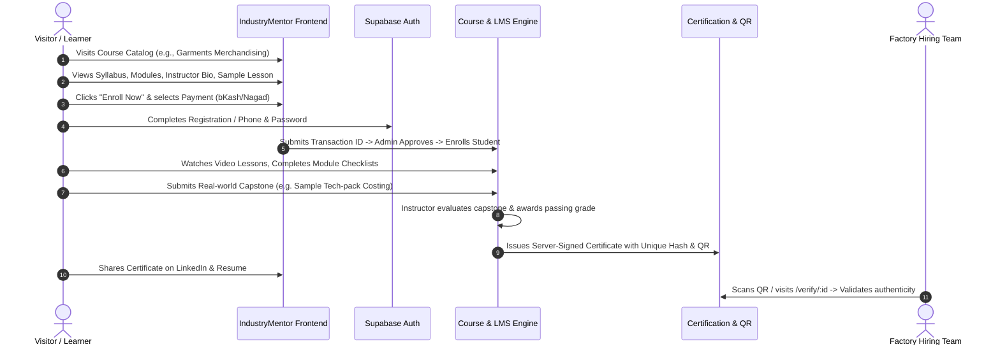
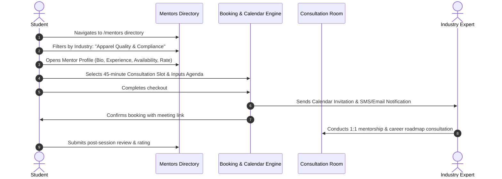

# IndustryMentor.net — Product Requirements Document (PRD)

**Document Version:** 1.0.0  
**Status:** Approved for Foundation Planning  
**Target Domain:** [https://industrymentor.net](https://industrymentor.net)  
**Primary Industry Focus:** Apparel, Garment Merchandising, Industrial Engineering, Supply Chain, Production Management, Quality Assurance.

---

## 1. Product Vision & Mission

### Core Mission
> "To bridge the gap between theoretical academic education and practical real-world industry execution by empowering emerging professionals with practitioner-led training, 1:1 expert mentorship, production-ready resources, and verified credentials."

### Long-Term Product Vision
To establish IndustryMentor as the premier vertical career operating system for industrial and manufacturing sectors in South Asia and global emerging markets. The platform will serve as an integrated ecosystem combining:
1. **Practical Academy:** Outcome-driven courses teaching operational execution rather than abstract concepts.
2. **Practitioner Marketplace:** Verified 1:1 access to factory general managers, technical heads, and buying-house leaders.
3. **Operational Toolkit:** Standard Operating Procedures (SOPs), production calculators (SMV, line balancing, consumption formulas), and audit templates.
4. **Talent & Career Passport:** Verifiable, skill-based project portfolios connecting qualified graduates directly with hiring factories and buying houses.

---

## 2. Problem Statement

1. **The Academic Disconnect:** Universities and polytechnic institutes teach engineering fundamentals from textbooks that are 10–20 years outdated. Graduates understand textile chemistry or mechanical engineering formulas, but cannot calculate fabric consumption per dozen garments, read a buyer tech-pack, or balance a 40-machine sewing floor.
2. **The "Catch-22" of Experience:** Employers in manufacturing require 2–3 years of hands-on floor experience for junior roles. Fresh candidates have no avenue to acquire operational experience before getting hired.
3. **Inaccessible Mentorship:** Industry veterans and factory leaders possess immense tacit knowledge, but have no structured channel to mentor young talent outside of ad-hoc personal favors.
4. **Unstandardized Documentation:** Factory SOPs, compliance audit guidelines, and quality checklists are fragmented across personal hard drives and Word documents without standard industry accreditation.

---

## 3. Target User Personas

### Persona A: The Aspiring Engineer / Fresh Graduate (Tanvir)
- **Background:** Recent B.Sc. in Textile Engineering or Industrial & Production Engineering (IPE).
- **Core Pain Point:** Applied to 20+ garment factories; rejected repeatedly for "lack of practical merchandising or floor experience." Doesn't know how to negotiate with international buyers or conduct pre-production meetings.
- **Goal:** Learn exact, day-to-day garment merchandising workflows, complete a real-world tech-pack assignment, earn a verified certificate, and get hired.

### Persona B: The Floor Supervisor / Career Advancer (Rashed)
- **Background:** 4 years working as an assistant quality controller or junior line supervisor in a knitwear factory.
- **Core Pain Point:** Career growth is stalled because he lacks mastery of modern Industrial Engineering (IE), Standard Minute Value (SMV) optimization, and production automation.
- **Goal:** Complete specialized night/weekend self-paced modules in IE and lean manufacturing to qualify for Assistant Production Manager (APM).

### Persona C: The Industry Expert / Mentor (Engr. Mahfuz)
- **Background:** Senior Merchandising Manager / Factory General Manager with 15+ years of experience across Tier-1 garment exporters.
- **Core Pain Point:** Wants to give back to the industry and build a personal brand/consultancy, but lacks the technical platform to host video courses, manage payments, and schedule 1:1 office hours.
- **Goal:** Host courses, mentor 3–5 dedicated students per week via paid 1:1 video consultations, and recruit top students directly for his company.

### Persona D: The Factory HR / Buying House Director (Farzana)
- **Background:** Head of Talent Acquisition at a top garment manufacturing conglomerate.
- **Core Pain Point:** Wastes weeks interviewing candidates who have stellar GPAs but fail basic practical tests on sewing machine allocation, defect classification, or shipment logistics.
- **Goal:** Source pre-vetted candidates who hold IndustryMentor verified certificates and review their completed capstone project portfolios.

---

## 4. End-to-End User Journeys

### Journey 1: Learner Journey (Visitor → Registration → Learning → Certification → Career)

### Journey 2: Mentorship Journey (Discovery → Profile → Booking → 1:1 Session)

---

## 5. Goals & Success Metrics (KPIs)

### Business Goals
1. Establish market leadership as the premier practical manufacturing education platform in Bangladesh and regional hubs.
2. Achieve unit profitability on course sales and SOP downloads with an automated checkout flow.
3. Attract and retain 50+ vetted industrial mentors across Garment, IE, Supply Chain, and Quality sectors.

### User Goals
1. Provide learners with direct floor-ready competencies applicable on day one in an industrial facility.
2. Provide industry experts with a seamless teaching, mentoring, and monetization engine.
3. Provide employers with dependable proof-of-competency for new hires.

### Platform Key Performance Indicators (KPIs)

| Metric Category | Target (Year 1) | Measurement Frequency |
| :--- | :--- | :--- |
| **Course Completion Rate** | $\ge 60\%$ (Industry average is $10\%$) | Monthly |
| **Certificate Verification Volume**| $\ge 500$ monthly QR validations | Monthly |
| **Learner Placement / Promotion** | $\ge 40\%$ within 90 days of graduation | Quarterly |
| **Mentor Satisfaction (CSAT)** | $\ge 4.8 / 5.0$ | Per Session |
| **Payment Drop-off Rate** | $\le 15\%$ after automated checkout | Weekly |

---

## 6. Functional Requirements by Module

### Module 1: Course Marketplace & Learning Management (LMS)
- **FR-1.1:** Dedicated course detail pages (`/courses/:slug`) with curriculum breakdown, learning objectives, instructor credentials, and FAQ.
- **FR-1.2:** Course Player interface (`/learn/:courseId/:lessonId`) featuring embedded video streaming, collapsible syllabus sidebar, lesson completion checkboxes, and resource attachments.
- **FR-1.3:** Search and filter engine across course catalog supporting filters by Industry Sector, Difficulty Level (Beginner/Intermediate/Advanced), and Delivery Mode (Recorded / Live Workshop).
- **FR-1.4:** Course Reviews & Ratings: authenticated learners who complete $>50\%$ of a course can submit verified ratings and reviews.

### Module 2: Mentorship Marketplace & Booking
- **FR-2.1:** Standalone `/mentors` directory with search by domain expertise, current company, language, and hourly consultation rate.
- **FR-2.2:** Detailed Mentor Profile page (`/mentors/:id`) featuring video introduction, employment history, focus areas, and available calendar slots.
- **FR-2.3:** Booking engine with pre-session questionnaire (allowing students to attach resumes or tech-packs for review).

### Module 3: Operational Resource Library & SOP Store
- **FR-3.1:** Dedicated `/library` directory categorizing downloadable materials into **eBooks**, **Standard Operating Procedures (SOPs)**, **Excel Calculation Sheets**, and **Audit Checklists**.
- **FR-3.2:** Secure download tokens: files are stored in private storage buckets and accessible only via signed, time-limited URLs upon verified purchase.

### Module 4: Verified Certification & Talent Portfolio
- **FR-4.1:** Server-signed PDF certificate generation with tamper-proof cryptographic UUID and verifiable QR code.
- **FR-4.2:** Public verification page (`/verify/:id`) rendered consistently with the brand dark theme, displaying student name, course title, issuance date, instructor signature, and list of mastered competencies.

### Module 5: Payment Processing & Order Management
- **FR-5.1:** Payment Gateway Integration supporting direct mobile financial services (bKash Checkout API, Nagad, Rocket) and cards (SSLCommerz/Shurjopay).
- **FR-5.2:** Fallback manual payment system: captures and validates transaction ID, sender mobile number, and receipt screenshot, presenting them in the Admin Panel for 1-click verification.

---

## 7. Non-Functional Requirements (NFR)

1. **Performance:** Maximum First Contentful Paint (FCP) $\le 1.2\text{s}$, Largest Contentful Paint (LCP) $\le 2.2\text{s}$ on 4G mobile connections.
2. **Security & Privacy:**
   - Full Row Level Security (RLS) enforcement across all Supabase tables.
   - Authentication tokens encrypted and transmitted via HTTP-only, secure cookies or protected local storage.
   - Zero exposure of private student contact numbers to public visitors.
3. **Availability & Resilience:** 99.9% uptime guaranteed via Cloudflare Edge network and Supabase hosted PostgreSQL multi-zone infrastructure.
4. **Accessibility (WCAG 2.1 AA):** High-contrast text legibility, full keyboard navigation support, and explicit ARIA labels on all interactive elements.

---

## 8. Release Roadmap Horizons

### Phase 0: Foundation & Critical Hardening (Sprint 1–2)
- Fix uncontrolled transaction ID input in Course Enrollment.
- Secure Supabase RLS policies for `site_settings` and `site_assets`.
- Remove hardcoded client-side admin credentials.
- Deploy OpenGraph images, canonical URLs, and robots.txt rules.

### Phase 1: Core Experience & Discoverability (Sprint 3–4)
- Build dedicated `/courses/:slug` course syllabus and detail pages.
- Build dedicated `/mentors` directory and `/library` catalog pages.
- Redesign `/verify/:id` to match the brand design system.

### Phase 2: Interactive Learning & Automated Commerce (Sprint 5–7)
- Launch LMS Course Player for enrolled students.
- Integrate bKash Direct Checkout & SSLCommerz automated payment gateways.
- Implement 1:1 Mentorship appointment booking flow.

### Phase 3: Career Passport & Industrial Tools (Sprint 8–10)
- Transform `/stopwatch` into a specialized "IE & Time Study Workstation" (SMV calculator, efficiency benchmarking).
- Launch Student Capstone Project Portfolio.
- Enable direct talent scouting for partner garment factories.
