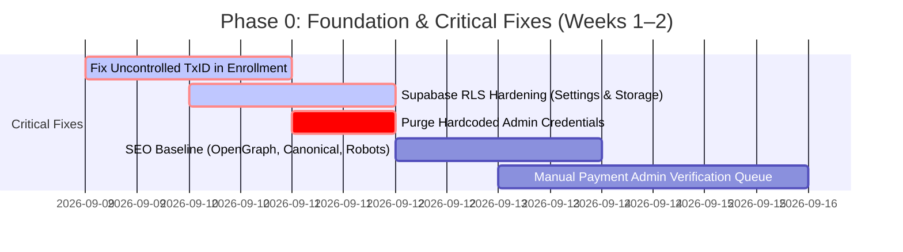
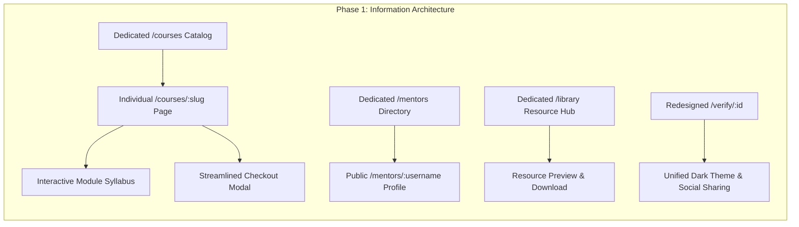
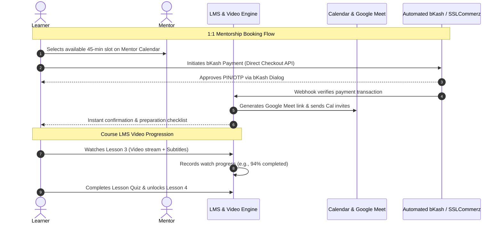
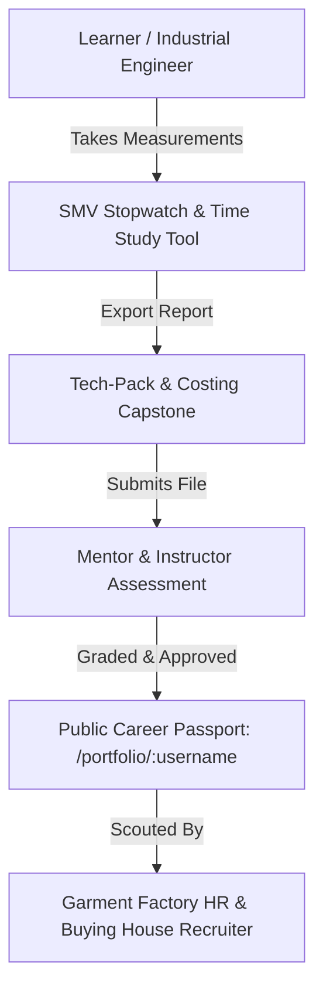
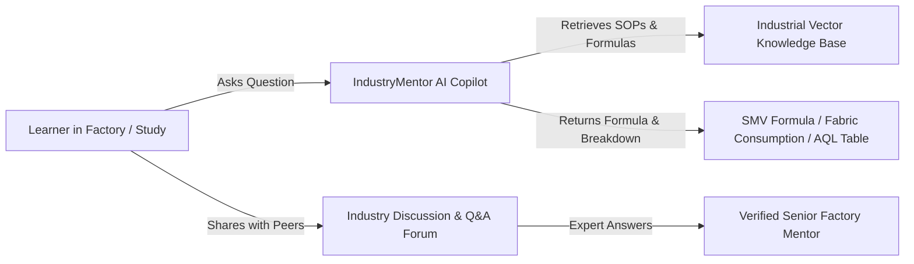
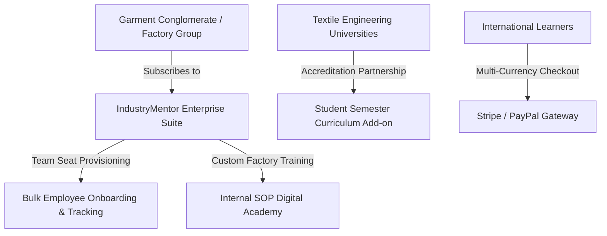

# IndustryMentor.net — Strategic Product & Engineering Roadmap

**Document Version:** 1.0.0  
**Target Domain:** [https://industrymentor.net](https://industrymentor.net)  
**Lifecycle Horizon:** 18-Month Multi-Phase Execution Plan  
**Strategic Focus:** South Asian Apparel, Textile, Industrial Engineering (IE), and Manufacturing Careers  

---

## Roadmap Overview & Horizon Matrix

| Phase | Strategic Horizon | Timeframe | Primary Objective | Target Metric / North Star |
| :--- | :--- | :--- | :--- | :--- |
| **Phase 0** | **Foundation & Security Hardening** | Weeks 1–2 | Fix P0 security, payment data loss, and RLS leaks | Zero unverified enrollments; 100% data integrity |
| **Phase 1** | **Core Platform & Discoverability** | Weeks 3–6 | Full IA restructure (dedicated courses, mentors, library) | Bounce rate reduction < 45%; Organic search indexing |
| **Phase 2** | **Mentorship & Automated Commerce** | Weeks 7–12 | 1:1 booking engine, LMS video player, bKash automated API | Automated payment conversion > 85%; First 50 1:1 sessions |
| **Phase 3** | **Practical Projects & Career Passport** | Weeks 13–18 | Verified portfolios, Capstone reviews, Industrial Tools | 100 verified graduate portfolios; 10 hiring factory partners |
| **Phase 4** | **Community & AI Copilot** | Weeks 19–26 | Peer cohort discussions & AI Industrial Assistant | Daily Active Users (DAU) / Monthly Active Users (MAU) > 30% |
| **Phase 5** | **B2B Factory Enterprise & Scale** | Months 7–12 | Corporate training tiers, university licenses, mobile app | MRR > $10,000; 5 enterprise factory contracts |

---

## Phase 0: Foundation & Security Hardening (P0 Immediate Priority)

> **Theme:** Fix critical vulnerabilities, eliminate silent data loss during checkout, secure database access controls, and repair broken SEO social previews.



### 0.1 Fix Uncontrolled Transaction ID in Course Enrollment
- **Priority:** `P0 (Critical Blocker)`
- **Purpose:** Currently in `src/pages/CourseEnrollment.tsx`, the Transaction ID input field is completely unmanaged by React state or form hooks. Clicking "Confirm Payment" submits an enrollment record without capturing the transaction ID, resulting in unverified enrollments and zero payment audit trail.
- **User Value:** Learners receive immediate visual confirmation that their payment reference was logged; administrators avoid chasing students via phone or WhatsApp to identify bank transactions.
- **Technical Complexity:** `Low`
- **Dependencies:** None. Direct state binding in `CourseEnrollment.tsx` and database column mapping in `enrollments` table.

### 0.2 Supabase Row Level Security (RLS) & Storage Hardening
- **Priority:** `P0 (Critical Security)`
- **Purpose:** Close open RLS policies on `site_settings` (which currently allows any authenticated user to update platform branding) and `site_assets` storage bucket (which allows authenticated users to delete global assets).
- **User Value:** Protects platform stability, customer privacy, and brand integrity against malicious script execution or unauthorized content tampering.
- **Technical Complexity:** `Medium`
- **Dependencies:** Supabase Migration SQL script applied via Supabase Dashboard / CLI; verification of `profiles.is_admin` helper function.

### 0.3 Purge Hardcoded Admin Credentials from Client Bundle
- **Priority:** `P0 (Critical Security)`
- **Purpose:** Remove hardcoded fallback email strings (`maqaiyumtalukder@gmail.com`) in `src/pages/Auth.tsx` and `src/components/auth/AdminGuard.tsx`. Admin authorization must be strictly derived from database claims (`profiles.is_admin` or user app metadata).
- **User Value:** Eliminates attack vectors where malicious users attempt credential stuffing against exposed administrative emails.
- **Technical Complexity:** `Low`
- **Dependencies:** DB role schema verification.

### 0.4 SEO Baseline (Social OpenGraph, Canonical URLs, Robots.txt)
- **Priority:** `P1 (High)`
- **Purpose:** Replace broken `/public/opengraph.png` (404 on Facebook/LinkedIn link previews), set absolute canonical links (`https://industrymentor.net/`), and prevent web crawlers from indexing private `/admin` or `/dashboard` routes.
- **User Value:** Rich link previews generate professional CTR when alumni or mentors share courses on LinkedIn and Facebook groups.
- **Technical Complexity:** `Low`
- **Dependencies:** Creation of branded 1200x630px social banner asset; update `index.html` and `public/robots.txt`.

### 0.5 Manual Payment Admin Verification Queue
- **Priority:** `P1 (High)`
- **Purpose:** Provide an administrative interface inside `/admin` to view pending manual payments, display student contact number, selected payment gateway, entered TxID, and one-click "Approve & Enroll" or "Reject & Notify" actions.
- **User Value:** Students are activated in minutes rather than hours; administrators can reconcile bank statements effortlessly.
- **Technical Complexity:** `Medium`
- **Dependencies:** `enrollments` table schema with status column (`pending`, `active`, `rejected`).

---

## Phase 1: Core Platform & Discoverability (Weeks 3–6)

> **Theme:** Complete the missing Information Architecture (IA), transition from a single-page marketing landing page into a multi-page web platform, and unify the visual design language.



### 1.1 Dedicated Course Detail & Syllabus Pages (`/courses/:slug`)
- **Priority:** `P0 (Core IA)`
- **Purpose:** Replace the existing modal popup viewer with dedicated, crawlable course URLs (`/courses/garments-merchandising`, `/courses/industrial-engineering-smv`). Include comprehensive curriculum outline, prerequisite breakdown, instructor credentials, sample video preview, and FAQ.
- **User Value:** Potential students can bookmark, share, and review deep course information. Search engines can index long-tail keywords for specialized courses.
- **Technical Complexity:** `Medium`
- **Dependencies:** Dynamic route in `App.tsx`; `useCourseBySlug` hook; SEO metadata tags per course.

### 1.2 Dedicated Mentors Directory & Profile Pages (`/mentors` & `/mentors/:username`)
- **Priority:** `P1 (Core IA)`
- **Purpose:** Replace the redirect `<Navigate to="/#mentors" />` with a full directory featuring search, department filtering (Merchandising, IE, Quality, Supply Chain), years of factory experience, and individual mentor profiles.
- **User Value:** Learners can evaluate mentors' factory credentials, read student reviews, and view available mentorship slots.
- **Technical Complexity:** `Medium`
- **Dependencies:** `mentors` table relational expansion (bio, company, designation, expertise tags, hourly rate).

### 1.3 Dedicated Resource Library (`/library`)
- **Priority:** `P1 (Core IA)`
- **Purpose:** Transform the current redirect into a production resource repository offering downloadable garment spec sheets, SMV calculation Excel templates, AQL inspection checklists, and fabric consumption charts.
- **User Value:** Immediate practical utility for working factory professionals, driving daily organic platform return visits.
- **Technical Complexity:** `Medium`
- **Dependencies:** Supabase storage bucket `public_resources` with download rate limiting and gated access (free vs. premium).

### 1.4 Redesign Certificate Verification Page (`/verify/:id`)
- **Priority:** `P1 (UX Unification)`
- **Purpose:** The current verification page has an inconsistent light background (`bg-gray-50`) conflicting with the platform's signature dark aesthetic. Redesign `/verify/:id` with high-contrast dark theme, authenticated cryptographic badge, dynamic QR code verification, and a "Share to LinkedIn" 1-click button.
- **User Value:** Boosts student pride in sharing credentials; gives employers instant, tamper-proof proof of skill mastery.
- **Technical Complexity:** `Low`
- **Dependencies:** Certificate metadata schema and Lucide icon badge rendering.

### 1.5 Course Reviews & Social Proof Engine
- **Priority:** `P2 (Conversion)`
- **Purpose:** Allow enrolled students who complete $\ge 80\%$ of a course to leave a star rating and written testimonial, subject to admin moderation.
- **User Value:** Authentic peer validation significantly increases enrollment conversion rates for undecided visitors.
- **Technical Complexity:** `Medium`
- **Dependencies:** `course_reviews` table with student ID, course ID, rating (1–5), and comment text.

---

## Phase 2: Mentorship & Automated Commerce (Weeks 7–12)

> **Theme:** Transform IndustryMentor into an interactive learning management system with structured lesson tracking, 1:1 video consultation scheduling, and instant mobile payment gateway checkout.



### 2.1 Native LMS Video Player & Progress Tracker
- **Priority:** `P0 (Core Value)`
- **Purpose:** Provide enrolled students with an immersive, distraction-free learning environment (`/learn/:courseSlug/:lessonId`) featuring video playback (Cloudflare Stream / Bunny.net / Vimeo unlisted embed), auto-resume timestamp, playback speed controls, lesson attachments, and module completion checkboxes.
- **User Value:** High-quality video delivery with minimal buffering on low-bandwidth factory mobile connections; structured progression tracking.
- **Technical Complexity:** `High`
- **Dependencies:** `lessons`, `modules`, and `user_lesson_progress` database tables; video player component (`video.js` or standard HTML5 video).

### 2.2 Automated Payment Gateway Integration (bKash Checkout & SSLCommerz)
- **Priority:** `P0 (Revenue Automation)`
- **Purpose:** Integrate bKash Direct Merchant API and SSLCommerz / Shurjopay gateway for frictionless, automated 1-click mobile transactions. Eliminates manual verification delays.
- **User Value:** Instant enrollment access immediately upon entering bKash PIN without waiting for manual admin approval.
- **Technical Complexity:** `High`
- **Dependencies:** Supabase Edge Functions for webhook receipt, payment verification signature hashing, and TLS callback handling.

### 2.3 1:1 Mentorship Booking & Scheduling Engine
- **Priority:** `P1 (Differentiator)`
- **Purpose:** Enable mentors to set weekly availability (e.g., Fridays 4:00 PM – 8:00 PM), sync with Google Calendar, define session rates, and allow students to book 30-minute or 60-minute advisory calls.
- **User Value:** Direct, friction-free access to senior factory managers and technical heads for career advice, resume reviews, and factory troubleshooting.
- **Technical Complexity:** `High`
- **Dependencies:** `mentor_availability`, `mentorship_sessions` tables; Google Calendar API integration / Webhook notifications.

### 2.4 In-App Notification System & Email Triggers
- **Priority:** `P2 (Retention)`
- **Purpose:** Deploy transactional notification emails (via Resend or SendGrid) and in-app badge alerts for: payment confirmations, upcoming 1:1 sessions, course assignment reviews, and certificate issuances.
- **User Value:** Keeps students engaged, minimizes no-shows for scheduled mentorship calls, and delivers instant receipts.
- **Technical Complexity:** `Medium`
- **Dependencies:** Supabase Edge Function with Resend API key; `notifications` database table.

---

## Phase 3: Practical Projects & Career Passport (Weeks 13–18)

> **Theme:** Implement the industrial wedge: practical capstone evaluations, verifiable portfolios, and specialized industrial engineering toolkits.



### 3.1 Industrial Engineering & Time Study Workstation (SMV Suite)
- **Priority:** `P0 (Core Industry Wedge)`
- **Purpose:** Transform the rudimentary `/stopwatch` route into a production-grade Garment Industrial Engineering toolkit:
  - Multi-lap cycle time observer for sewing operations.
  - Standard Minute Value (SMV) calculator incorporating rating factor and machine allowances.
  - Line balancing simulator for calculating sewing line efficiency ($\%$).
  - One-click CSV/Excel export for factory IE engineers.
- **User Value:** Immediate daily operational tool for industrial engineers, line chiefs, and students practicing floor studies.
- **Technical Complexity:** `Medium`
- **Dependencies:** Client-side local storage engine with exportable Excel/CSV generator.

### 3.2 Real-World Capstone Project Submission & Grading
- **Priority:** `P1 (Educational Quality)`
- **Purpose:** Courses culminate in practical real-world assignments (e.g., "Calculate garment consumption for 5,000 pcs polo shirts" or "Draft a factory compliance audit response"). Students upload their deliverables; mentors review, annotate, and grade.
- **User Value:** Proves actual job competence over passive video watching; provides tangible artifacts for job applications.
- **Technical Complexity:** `Medium`
- **Dependencies:** `submissions` table, file upload bucket `student_projects`, and grading rubric interface in instructor dashboard.

### 3.3 Public Career Passport & Portfolio (`/portfolio/:username`)
- **Priority:** `P1 (Career Placement)`
- **Purpose:** Allow students to publish a verified digital portfolio displaying their completed capstone projects, verified IndustryMentor certificates, mastered competencies (e.g., Fabric Sourcing, SMV Study, AQL 2.5), and mentor recommendations.
- **User Value:** Replaces outdated paper resumes with a verified, interactive link that students place on LinkedIn and submit to factory job applications.
- **Technical Complexity:** `Medium`
- **Dependencies:** Public dynamic route, SEO microdata (`schema.org/Person`), and privacy controls.

### 3.4 Factory Hiring Partner Portal
- **Priority:** `P2 (B2B Monetization)`
- **Purpose:** A dedicated portal for factory HR managers and buying house recruiters to search pre-vetted candidates filtered by verified skills, course grades, and location.
- **User Value:** Dramatically lowers hiring risk and recruitment cycle time for textile mills, garment factories, and buying offices.
- **Technical Complexity:** `High`
- **Dependencies:** Employer authentication role, talent search queries, candidate messaging flow.

---

## Phase 4: Community & AI Industrial Copilot (Weeks 19–26)

> **Theme:** Increase learner retention, encourage peer knowledge exchange, and provide 24/7 AI-assisted factory problem solving.



### 4.1 Industry Discussion Forums & Q&A Hub (`/community`)
- **Priority:** `P1 (Retention & Community)`
- **Purpose:** A structured forum categorized by technical domains (e.g., #merchandising-costing, #washing-dyeing, #factory-compliance, #ie-automation). Students and working professionals can post floor challenges and receive peer/mentor answers.
- **User Value:** Creates a dynamic, self-sustaining community network for apparel and manufacturing professionals.
- **Technical Complexity:** `Medium`
- **Dependencies:** `forum_posts`, `forum_comments`, `upvotes` database tables; markdown editor with image upload.

### 4.2 AI Industrial Copilot (Domain-Trained Assistant)
- **Priority:** `P2 (AI Innovation)`
- **Purpose:** An integrated AI assistant grounded in textile formulas, garment merchandising math, compliance standards (WRAP, BSCI, OEKO-TEX), and machine maintenance troubleshooting.
- **User Value:** Provides 24/7 instant math assistance (e.g., "Calculate yarn count conversion from English Ne to Tex" or "Explain step-by-step how to resolve puckering in single jersey seams").
- **Technical Complexity:** `High`
- **Dependencies:** Gemini API integration via serverless Edge Function with domain-specific system prompts and retrieval-augmented knowledge base.

### 4.3 Automated Quiz & Knowledge Checkpoints
- **Priority:** `P2 (LMS Engagement)`
- **Purpose:** Interactive multiple-choice and formula calculation quizzes after each course module. Requires an $80\%$ pass score to unlock the subsequent module.
- **User Value:** Reinforces lesson retention and ensures authentic mastery before issuing certificates.
- **Technical Complexity:** `Medium`
- **Dependencies:** `quizzes`, `quiz_questions`, and `quiz_attempts` relational schema.

---

## Phase 5: Monetization, B2B Enterprise & Scale (Months 7–12)

> **Theme:** Scale revenue through B2B factory workforce training subscriptions, university institutional partnerships, and native mobile distribution.



### 5.1 B2B Enterprise & Factory Training Subscription
- **Priority:** `P1 (B2B Revenue)`
- **Purpose:** Enterprise subscription allowing garment factories to purchase 20–100 seat licenses to upskill junior merchandisers, line supervisors, and quality auditors. Includes an HR Manager Dashboard with company-wide completion tracking.
- **User Value:** Factories upgrade their workforce efficiency, cut down production defects, and retain top talent.
- **Technical Complexity:** `High`
- **Dependencies:** Multi-tenant organization schema, team manager roles, seat allocation logic.

### 5.2 University & Polytechnic Partnership Portal
- **Priority:** `P2 (Distribution Channel)`
- **Purpose:** Enable textile universities (e.g., BUTEX, BGMEA University of Fashion & Technology, NITER) and polytechnic institutes to integrate IndustryMentor courses as practical lab supplements in their semester curriculum.
- **User Value:** Prepares graduating cohorts for immediate employment upon graduation; gives IndustryMentor bulk user acquisition.
- **Technical Complexity:** `Medium`
- **Dependencies:** Institutional discount codes, bulk cohort enrollment, grade report export.

### 5.3 Multi-Currency & Global Payment Gateway (Stripe / International Cards)
- **Priority:** `P2 (Regional Expansion)`
- **Purpose:** Expand payment acceptance to include international credit cards, USD/EUR pricing via Stripe, and regional payment methods for learners across India, Pakistan, Vietnam, and Sri Lanka.
- **User Value:** Unlocks international student enrollment across South Asian garment manufacturing hubs.
- **Technical Complexity:** `Medium`
- **Dependencies:** Stripe integration via Supabase Edge Functions; multi-currency pricing display.

### 5.4 Progressive Web App (PWA) & Offline Video Caching
- **Priority:** `P2 (Mobile UX)`
- **Purpose:** Package the application as an installable PWA with service worker caching, enabling offline viewing of downloaded lesson notes, SMV stopwatch utility usage without cellular connection, and native push notifications.
- **User Value:** Seamless mobile app experience on low-cost Android smartphones common across factory staff.
- **Technical Complexity:** `High`
- **Dependencies:** Service worker implementation (`workbox`), IndexedDB storage for offline templates.

---

## Summary Dependency & Execution Matrix

```
[Phase 0: Fix TxID + RLS + SEO]
       │
       ▼
[Phase 1: Dedicated Courses, Mentors, Library & Verify Redesign]
       │
       ├─────────────────────────────────────────┐
       ▼                                         ▼
[Phase 2: Video LMS + Automated bKash]    [Phase 3: SMV Tool & Capstones]
       │                                         │
       ├─────────────────────────────────────────┘
       ▼
[Phase 4: Community Forums & AI Industrial Copilot]
       │
       ▼
[Phase 5: B2B Enterprise Factory Training & Global Scale]
```

---

*This document serves as the master execution blueprint for IndustryMentor.net. All sprints and development tasks must trace directly to milestones established in this roadmap.*
