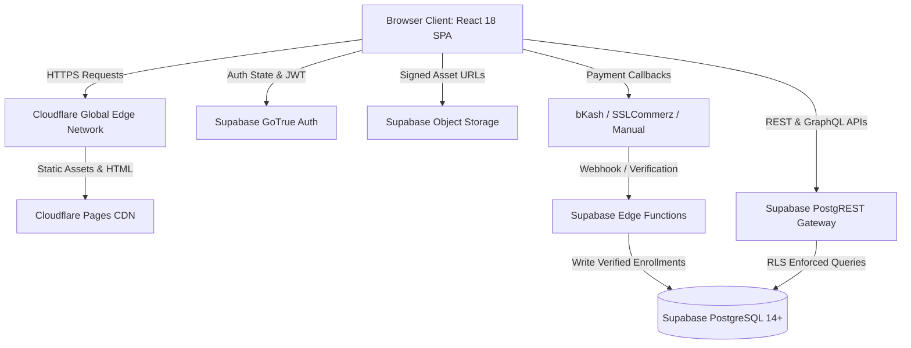
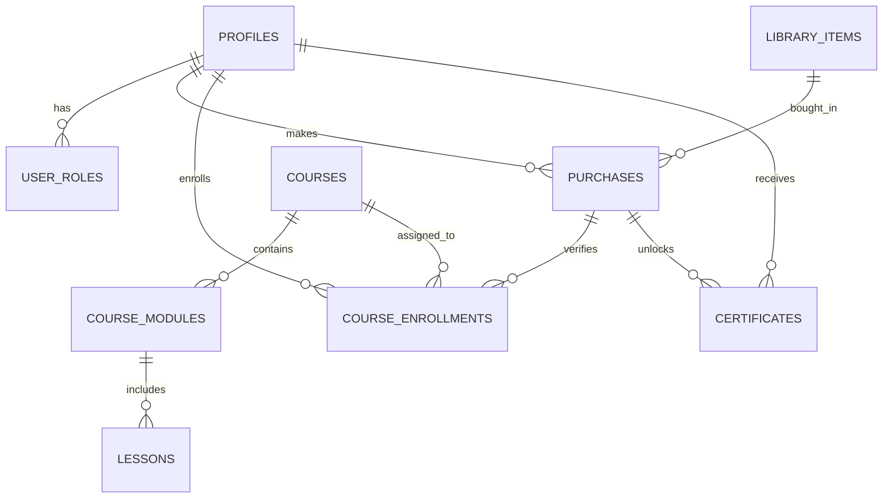
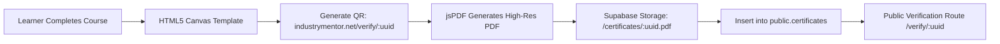

# IndustryMentor.net — Technical Requirements Document (TRD)

**Document Version:** 1.0.0  
**Target Architecture:** Jamstack / Headless SPA + Serverless Backend + Edge CDN  
**Primary Tech Stack:** Vite, React 18, TypeScript, Tailwind CSS, Supabase (PostgreSQL 14+), Cloudflare Pages.

---

## 1. System Architecture Overview



---

## 2. Frontend Architecture

### 2.1 Directory Structure & Boundaries
```
src/
├── assets/             # Static SVGs, branded logos, optimized course covers
├── components/
│   ├── admin/          # Administrative navigation & management wrappers
│   ├── auth/           # RBAC guards (RequireAuth, RequireAdmin), providers
│   ├── layouts/        # Shell layouts (SiteLayout, AdminLayout)
│   ├── sections/       # Composable homepage & marketing sections
│   └── ui/             # Atomic shadcn/ui and Radix UI primitives
├── features/
│   ├── admin/          # Domain-specific admin feature modules
│   ├── certificates/   # PDF generator and canvas rendering engine
│   ├── dashboard/      # Student dashboard tabs and profile editors
│   └── library/        # Resource catalog, filtering, and checkout dialogs
├── hooks/              # Reusable React state & Supabase data hooks
├── integrations/
│   └── supabase/       # Typed Supabase client & generated database types
├── lib/                # Utility helpers (cn, formatting, validators)
├── pages/              # Route entry points (lazy-loaded via React.lazy)
└── test/               # Vitest unit test suites and mock setups
```

### 2.2 Routing Strategy & Code Splitting
- **Router:** `react-router-dom` v6 with declarative browser history.
- **Code Splitting:** Dynamic imports via `React.lazy()` and `<Suspense>` wrapped in `src/App.tsx`.
- **Chunking Optimization:** Reconfigure `vite.config.ts` with `rollupOptions.output.manualChunks` to split heavy vendor modules (`recharts`, `jspdf`, `html2canvas`, `@radix-ui`) into isolated cached vendor bundles.

---

## 3. Backend & Database Architecture

### 3.1 Entity Relationship Diagram (Core Data Model)



### 3.2 Database Tables & Schema Specifications

#### 1. Table: `public.profiles`
Stores student, instructor, and administrator profile metadata linked directly to `auth.users`.
```sql
CREATE TABLE public.profiles (
    id UUID PRIMARY KEY DEFAULT gen_random_uuid(),
    user_id UUID NOT NULL UNIQUE REFERENCES auth.users(id) ON DELETE CASCADE,
    full_name TEXT NOT NULL,
    phone TEXT UNIQUE,
    avatar_url TEXT,
    bio TEXT,
    industry TEXT,
    company TEXT,
    created_at TIMESTAMPTZ NOT NULL DEFAULT now(),
    updated_at TIMESTAMPTZ NOT NULL DEFAULT now()
);
```

#### 2. Table: `public.courses` & `public.course_modules`
Manages course curriculum hierarchy.
```sql
CREATE TABLE public.courses (
    id UUID PRIMARY KEY DEFAULT gen_random_uuid(),
    slug TEXT NOT NULL UNIQUE,
    title TEXT NOT NULL,
    description TEXT,
    price_cents INTEGER NOT NULL DEFAULT 0,
    old_price_cents INTEGER,
    cover_image_path TEXT,
    badge_text TEXT DEFAULT 'Professional',
    mode TEXT DEFAULT 'Online Recorded',
    industry TEXT NOT NULL DEFAULT 'Apparel & Textile',
    rating NUMERIC(2,1) DEFAULT 5.0,
    reviews_count INTEGER DEFAULT 0,
    published BOOLEAN NOT NULL DEFAULT false,
    created_at TIMESTAMPTZ NOT NULL DEFAULT now(),
    updated_at TIMESTAMPTZ NOT NULL DEFAULT now()
);

CREATE TABLE public.course_modules (
    id UUID PRIMARY KEY DEFAULT gen_random_uuid(),
    course_id UUID NOT NULL REFERENCES public.courses(id) ON DELETE CASCADE,
    title TEXT NOT NULL,
    description TEXT,
    order_index INTEGER NOT NULL DEFAULT 0,
    created_at TIMESTAMPTZ NOT NULL DEFAULT now()
);
```

#### 3. Table: `public.purchases` & Payment Tracking
Captures transaction IDs and prevents enrollment spoofing.
```sql
CREATE TABLE public.purchases (
    id UUID PRIMARY KEY DEFAULT gen_random_uuid(),
    user_id UUID NOT NULL REFERENCES auth.users(id) ON DELETE CASCADE,
    item_type TEXT NOT NULL CHECK (item_type IN ('course', 'ebook', 'sop', 'mentorship')),
    item_key TEXT NOT NULL,
    title TEXT NOT NULL,
    amount_cents INTEGER NOT NULL,
    payment_method TEXT NOT NULL DEFAULT 'bkash', -- bkash, nagad, sslcommerz, card
    transaction_id TEXT,                          -- e.g. '8N7X992A'
    sender_phone TEXT,                            -- Sender wallet number
    status TEXT NOT NULL DEFAULT 'pending',       -- pending, approved, rejected, refunded
    verified_by UUID REFERENCES auth.users(id),
    verified_at TIMESTAMPTZ,
    created_at TIMESTAMPTZ NOT NULL DEFAULT now()
);
```

### 3.3 Security & Row Level Security (RLS) Policy Hardening

```sql
-- Revoke insecure public mutations on site_settings
DROP POLICY IF EXISTS "Allow authenticated insert/update" ON public.site_settings;
CREATE POLICY "Admins only can modify site_settings"
ON public.site_settings FOR ALL
TO authenticated
USING (public.has_role(auth.uid(), 'admin'))
WITH CHECK (public.has_role(auth.uid(), 'admin'));

-- Secure storage bucket assets
DROP POLICY IF EXISTS "Authenticated Delete" ON storage.objects;
CREATE POLICY "Admins only can delete site assets"
ON storage.objects FOR DELETE
TO authenticated
USING (bucket_id = 'site_assets' AND public.has_role(auth.uid(), 'admin'));
```

---

## 4. Authentication, Authorization & RBAC

1. **Authentication Flow:** Supabase Auth issues JSON Web Tokens (JWT) containing user UUID and role claims.
2. **Role Verification:** Verified strictly via PostgreSQL `SECURITY DEFINER` function:
   ```sql
   CREATE OR REPLACE FUNCTION public.has_role(_user_id uuid, _role public.app_role)
   RETURNS boolean LANGUAGE sql STABLE SECURITY DEFINER SET search_path = public AS $$
     SELECT EXISTS (
       SELECT 1 FROM public.user_roles WHERE user_id = _user_id AND role = _role
     );
   $$;
   ```
3. **Client-Side Guarding:** `RequireAdmin.tsx` queries `has_role` before mounting administrative features, preventing UI leakage.

---

## 5. Certification & Cryptographic Verification Architecture


- **Unique Identifier:** Certificates receive a cryptographically random UUIDv4 (`0702f006-2232-...`).
- **QR Code Content:** Direct immutable URL `https://industrymentor.net/verify/{certificate_id}`.
- **Verification API:** Public unauthenticated endpoint returns only student full name, course title, completion date, and credential status (no private user details exposed).

---

## 6. Payment Gateway Architecture

### Phase 1: Managed Manual Payment (Immediate Fix)
- Bind the Transaction ID and Sender Phone inputs in `CourseEnrollment.tsx` using `react-hook-form` and `zod`.
- Insert records into `public.purchases` with status `'pending'`.
- Provide an Admin approval dashboard in `/admin/finance` with 1-click **"Verify & Grant Access"**.

### Phase 2: Automated Direct Checkout (bKash & SSLCommerz)
- **bKash Tokenized Checkout API:**
  1. Frontend calls Supabase Edge Function `create-payment`.
  2. Edge function communicates with bKash API using secure server-side credentials (`BKASH_APP_KEY`, `BKASH_APP_SECRET`).
  3. Returns payment URL / modal for student authorization.
  4. On callback verification, Edge Function updates purchase to `'approved'` and triggers automatic course enrollment.

---

## 7. Performance & Edge CDN Strategy

1. **Cloudflare Edge Rules:**
   - Static assets (`/assets/*.js`, `/assets/*.css`, `/assets/*.jpg`) cached with `Cache-Control: public, max-age=31536000, immutable`.
   - HTML documents served with `Cache-Control: public, max-age=0, must-revalidate` to ensure immediate updates upon continuous deployment.
2. **SPA Routing:** Managed by `public/_redirects` rule:
   ```text
   /*    /index.html   200
   ```
3. **Database Indexing:**
   - `CREATE INDEX idx_courses_published ON public.courses(published, created_at DESC);`
   - `CREATE INDEX idx_enrollments_user_course ON public.course_enrollments(user_id, course_id);`
   - `CREATE INDEX idx_purchases_status ON public.purchases(status);`

---

## 8. Backup, Disaster Recovery & Telemetry

1. **Database Backups:** Daily point-in-time automated backups managed via Supabase Pro tier with manual weekly SQL dumps stored in secure offline cloud storage.
2. **Error Tracking & Monitoring:** Integration of Sentry for frontend exception telemetry, unhandled promise rejections, and slow API tracking.
3. **Uptime Monitoring:** Cloudflare Health Checks and third-party monitoring (BetterStack / UptimeRobot) pinging `https://industrymentor.net/` every 60 seconds with SMS alerts on degradation.
